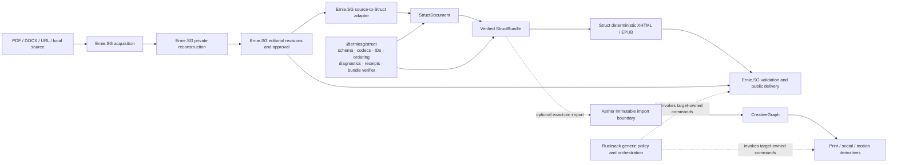

# ADR-0001: Domain ownership and package boundaries for Struct, Ernie.SG, Rucksack, and Aether

- Status: Proposed; implementation and issue creation are not authorized
- Date: 2026-08-27
- Decision owners: Ernie.SG project owner and repository maintainers
- Review scope: exact remote default heads and reviewed product-contract documentation listed below
- Supersedes: no accepted ADR; it reconciles the currently planned cross-repository product contracts

## Decision gate

This ADR is the review artifact required before repository reorganization or GitHub issue creation. It records a target, not a claim that the target is implemented.

No repository, branch, pull request, issue, package registry, deployment, or visibility setting was changed while preparing it. Approval of this ADR and its issue plan is required before issues may be created. Publishing a package, deploying an application, or activating a writer requires a later, target-specific gate even after this ADR is accepted.

## Frozen evidence baseline

The architecture assessment used these exact remote default heads:

| Repository | Default | Exact SHA | Relevant executable files over 3,000 physical LOC |
|---|---|---:|---:|
| `erniesg/rucksack` | `main` | `9284e95430bb1556d8614427ca05e553d9930dc9` | 0 of 579 scanned |
| `erniesg/erniesg` | `main` | `c7a706ecbac1a527cad11a3246e602bd56636d6f` | 0 of 604 scanned |
| `erniesg/struct` | `main` | `6ecb78d1753b847ec7295bf45f43237225663728` | 0 of 30 scanned |

The entry-gate scan covered tracked `.py`, `.ts`, `.tsx`, `.js`, `.jsx`, `.mjs`, `.cjs`, `.astro`, `.vue`, `.svelte`, and `.html` files throughout each repository. Remote default references and disposable exact-SHA checkouts were independently verified. The final Rucksack Evidence Lab page is a 36-line loader at the frozen head.

At final delivery revalidation, Rucksack `main` had advanced by ancestry to `2513b7a76ad50e9751101454054bf1120cb1983e`. The intervening range contains one Evidence Lab OCR-ambiguity hold change (`baf4699`) across three modular browser files and one E2E test, with 49 insertions and 5 deletions. A fresh tracked-file scan at `2513b7a7` remained 0 of 579 relevant executable files over 3,000 LOC; the range passed `git diff --check` and did not touch the Rucksack ownership, authority, import, package, workflow, or release evidence used by this ADR. Ernie.SG and Struct remained at the frozen SHAs above; Aether remained at `f8643bee4819afa465be3e32fdd63788566987e6`.

That extension list is the coordinator's explicit entry-gate scope, not an assertion that every executable or authority-bearing artifact in the repositories is below the threshold. In particular, generated publisher workflows remain large: Rucksack's `.github/workflows/agent-evidence-publisher.yml` is 7,775 lines and Ernie.SG's counterpart is 5,050 lines at the frozen heads. They must be registered as authority-bearing generated artifacts with an owner, reproducible generator/source digest, drift check, review class, and explicit size exception. They do not reopen the already satisfied gate, but they are not exempt from architecture or security ownership.

The following reviewed documentation heads were treated as product input, not as current runtime truth:

| Product | Reviewed documentation head | Relationship to current default |
|---|---:|---|
| Struct | `444317b64b72dbce6c0c0409716fb6a20e810b4d` | Four clean documentation commits directly on the frozen Struct default |
| Ernie.SG | `a45128c13839b7d5093ef7ba5e30790903007ed8` | Five documentation commits based on older `adf5708`; patch applies to the frozen default with one trailing-blank-line defect to repair |
| Aether | `860e60fd3791a8220b694bc53cc5a2e442cabfd2` | Documentation head diverges substantially from current Aether default; it must be manually reconciled, never wholesale cherry-picked |

The current Aether default observed during reconciliation was `f8643bee4819afa465be3e32fdd63788566987e6`. Aether is included because it is a planned consumer, but it is not part of the three-repository entry gate.

## State vocabulary and current truth

Every capability in this ADR is classified using four states:

- **Current:** observed in executable code at the frozen default.
- **Documented target:** product-reviewed input or proposed ADR design intent; it is not an implementation claim, and ADR-specific additions are not accepted until this ADR is approved.
- **Implemented, unreleased:** code and exact-head evidence exist, but no public package/application release has been proven.
- **Released:** an exact package or deployment identity and target-specific health/acceptance evidence have been recorded.

| System | Current at frozen head | Documented target | Implemented, unreleased gate | Released gate |
|---|---|---|---|---|
| Struct | Private `0.0.0`; document/codecs/IDs/recovery/XHTML/EPUB exist; no Bundle/verifier; no exact-pinned external consumer | Source-neutral package plus normative verified Bundle | S-02 through S-04 pass at one exact head and tarball digest | Separately authorized exact registry version, immutable artifact digest, install proof, and release record |
| Ernie.SG | Local duplicate Struct implementation; legacy `ResearchPaper`; separate `PublicationGraph`; browser/local-first review; no exact Struct package pin or durable publication transition | Owner-first acquisition/reconstruction/editorial/public-delivery application | Exact Struct artifact, durable record design, inactive writer path, parity, validation, and rollback evidence pass | Separately authorized writer/public-route activation with exact deployment and health/acceptance evidence |
| Aether | Divergent creator-workspace prototype, Convex state/run records, and PNG-ZIP export; no Struct import, `CreativeGraph`, print profile/preflight, or durable target release manifest | Optional owner-first visual-composition product and A5 print/social proof | Authenticated verified import and the bounded local proof pass behind an inactive route/feature gate; no printer submission | Separately authorized route/deployment and, if requested, printer submission plus exact storage, renderer/profile, proof, and health evidence |
| Rucksack | Generic policy/orchestration with broad facades, import cycles, and identified authority gaps; no Struct domain dependency | Narrow capability-scoped orchestration over target-owned commands | Exact-head safety and module-boundary issues pass | Exact version/deployment evidence for any activated orchestration; no floating install or inferred domain authority |

Configuration, documentation, a branch, or a passing local test is never by itself release evidence. The rest of this ADR describes documented target behavior unless it explicitly says current or released.

## Context

The size-reduction program removed immediate godfile pressure, but file size is not the remaining architectural problem. The remaining risks are competing semantic authorities, inward-pointing adapter dependencies, broad implicit public surfaces, duplicated implementations and tests, mixed mutation authority, and release seams that exist in prose but not in runtime code.

The clearest example is Struct. `erniesg/struct` was bootstrapped from `erniesg/erniesg`, yet Ernie.SG does not consume it as a package. Seven portable core files and all eight codec files are byte-identical at the frozen heads; the XHTML and EPUB renderers differ almost entirely by relative import paths. Both repositories can currently change the same behavior independently.

At the same time, the package is not yet a safe interchange boundary. It is private `0.0.0`, its tests import private `src/**` paths, and no runtime `StructBundle`, decoder, or verifier exists. The planned envelope also leaves canonical hashing, JSON byte encoding, asset ownership, resolution, and verified-value semantics underspecified.

Ernie.SG has multiple publication models in active use: a legacy `ResearchPaper`/EPUB path, the duplicated local Struct implementation, and a separate `PublicationGraph` compiler. Source reconstruction, editorial state, semantic output, rendering, and public delivery therefore do not yet form one governed lifecycle.

Rucksack is separate from that domain problem. It is a Python automation and policy system with a large import cycle and broad compatibility facades. More importantly, exact-head review found several high-risk authority seams: manifest-directed rollback can escape the CLI-selected repository, direct provisioning can bypass the durable coordinator, publisher credentials cross raw-token and global-environment boundaries, VM leases can renew stale generations, and supervised commands can leave descendants behind. A broad module move before closing or enclosing these seams would make review harder without making the system safer.

Aether is a potential downstream visual-composition consumer. Its current application is a prototype workspace and PNG-ZIP export system; it does not import Struct, verify a bundle, persist an immutable import receipt, or implement the target `CreativeGraph` and release-manifest boundary. Product prose must not be mistaken for an implemented dependency.

## Decision

Adopt four explicit bounded systems with one-way dependencies and no shared source ownership:

1. **Struct is the source-neutral semantic and deterministic reflowable-publication package.** It owns the `StructDocument` schema and codecs, stable IDs and relationships, ordering, source-neutral diagnostics and recovery data, semantic receipts, a versioned and fail-closed `StructBundle` contract, and deterministic XHTML/reflowable EPUB generation.
2. **Ernie.SG is the research reconstruction, editorial, and public-delivery application.** It owns PDF/DOCX/URL acquisition and extraction, private reconstruction types, `ResearchPaper` compatibility, source-specific adapters, Study/Astro UI, editorial approval and durable revision state, providers and evaluations, BookWorld/application deployment, accessibility and release acceptance, and public routes.
3. **Aether is an optional downstream visual-composition application.** If activated, it consumes only a verified, pinned Struct bundle. It owns `CreativeGraph`, explicit visual overrides, paged/print/social/motion composition, renderer profiles, preflight, and derivative release manifests. It never becomes a semantic document editor or reconstruction system.
4. **Rucksack is generic policy and orchestration.** It remains independent of Struct, Ernie.SG, and Aether domain models. It may eventually automate target-owned commands using immutable inputs and authenticated receipts, but it does not parse Struct documents, implement renderers, own editorial approval, or become a hidden package manager.

The stable dependency graph is:



Forbidden reverse edges are part of the decision:

- Struct must not import Ernie.SG, Aether, Rucksack, UI, storage, transport, providers, credentials, extraction, or release state.
- Struct document/schema modules must not import renderer modules.
- Ernie.SG UI and delivery code must not import private reconstruction internals directly; application services and app-owned adapters mediate the boundary.
- Aether must not copy or mutate canonical Struct text. Semantic corrections create a new approved upstream revision.
- Rucksack must not acquire a domain dependency on Struct or application-private state.

## Ownership and release boundaries

| Concern | Canonical owner | Public/release boundary | Explicit non-owner |
|---|---|---|---|
| PDF/DOCX/URL acquisition and extraction | Ernie.SG | Application service and source-evidence records | Struct, Aether, Rucksack |
| Private reconstruction and `ResearchPaper` compatibility | Ernie.SG | App-private types and a time-bounded compatibility adapter | Struct |
| Editorial decisions, approval, revision storage | Ernie.SG | Durable publication records with authenticated state transitions | Struct, Aether |
| `StructDocument` types, schema, codecs, migrations | Struct | Versioned package exports | Ernie.SG local copies |
| IDs, relationships, reading order | Struct | Stable package subpaths | App utilities |
| Source-neutral diagnostics, recovery facts, semantic receipt | Struct | Structured values and verification APIs | App-specific recovery copy |
| Source- and workflow-specific recovery wording | Ernie.SG | UI/presentation layer | Struct |
| `StructBundle` wire schema and verification | Struct | Stable `./bundle` export; verified-value API | Consumer ad hoc parsers |
| Bundle construction from an approved revision | Ernie.SG using Struct APIs | Export record plus verified bundle bytes | Aether, Rucksack |
| Producer authenticity and approval binding | Ernie.SG | Authenticated release/export record or purpose-specific detached signature binding the canonical full-bundle digest, approved revision, producer, audience/target, and status | Struct integrity verifier, self-attested bundle receipt |
| Deterministic XHTML/reflowable EPUB | Struct | Versioned renderer subpaths and profiles | Ernie.SG duplicate renderers |
| EPUBCheck, Ace, human accessibility approval | Ernie.SG | Release evidence and public-delivery state | Struct package unit tests |
| Astro/Study UI, BookWorld, providers/evals, deployment | Ernie.SG | Application release | Struct |
| Verified downstream import | Each consumer | Exact Struct pin plus consumer-owned immutable import receipt | Bundle top-level receipt |
| Creative layout, print/PDF-X, social/motion derivatives | Aether | `CreativeGraph`, profile, preflight, release manifest | Struct, Ernie.SG reconstruction |
| Repository policy, evidence collection, generic publication automation | Rucksack | Target-scoped ports and authenticated receipts | Domain packages |
| Credentials and mutation capability | Owning application/adapter boundary | Opaque, target-scoped, short-lived capability | Domain models and raw environment mutation |

Each repository remains an independent release boundary. Acceptance in one repository does not authorize publishing or deploying another.

## Struct target organization

```text
src/
  index.ts                         # slim, explicit convenience facade
  document/
    index.ts                       # public document contract
    model.ts                       # StructDocument and schema-owned types
    identity.ts                    # stable IDs and semantic digests
    ordering.ts                    # reading order and layout ordering
    receipt.ts                     # source-neutral semantic receipt and verifier
    recovery.ts                    # structured recovery/diagnostic data only
    legacy/
      v0_1.ts                      # isolated legacy locale/digest compatibility
    internal/
      decode.ts
      encode.ts
      invariants.ts                # never imports a renderer
      primitives.ts
      bytes.ts
      standards.ts
      canonical-json.ts
      sha256.ts
  bundle/
    index.ts                       # public create/decode/verify/encode facade
    model.ts                       # runtime and JSON wire types
    canonicalize.ts
    assets.ts
    limits.ts
    verify.ts
  renderers/
    shared/
      escaping.ts
      styles.ts
    xhtml/
      index.ts
      plan.ts                      # emitted-ID planning belongs here
      render.ts
    epub/
      index.ts
      ingress.ts                   # bounded renderer input normalization
      profile.ts
      archive.ts
      xhtml-integrity.ts
```

This is a responsibility tree, not a requirement to create one-function files. Small cohesive internals may remain combined. A module earns separation when it establishes a dependency boundary, test owner, public contract, or independently changeable policy.

### Struct public API

The first releasable export map is explicit and uses named exports:

| Package path | Stable surface |
|---|---|
| `@erniesg/struct` | Core `StructDocument` types, `StructCodecError`, `decodeStructDocument`, and `encodeStructDocument`; a migration export only when it performs a real version transform |
| `@erniesg/struct/document` | Full documented source-neutral document contract and version constants |
| `@erniesg/struct/identity` | Stable ID and semantic digest operations |
| `@erniesg/struct/ordering` | Reading-order helpers |
| `@erniesg/struct/receipt` | Semantic receipt types and fail-closed verification |
| `@erniesg/struct/recovery` | Structured, source-neutral diagnostic and recovery utilities |
| `@erniesg/struct/bundle` | Bundle runtime/wire types and create/decode/verify/encode operations, only when complete |
| `@erniesg/struct/renderers/xhtml` | Deterministic XHTML renderer and versioned options/profile |
| `@erniesg/struct/renderers/epub` | Deterministic EPUB builder and versioned profile/export types |

Do not expose `./core`, parser primitives, byte/hash implementations, renderer plans, archive/XML helpers, or legacy-digest internals as permanent API. Because the package is private `0.0.0` and has no exact-pinned external consumer at the frozen heads, the current `./core`, `./schema`, `./ids`, and thin `./recovery` aliases may be replaced before the first release. If evidence reveals a prerelease consumer, retain aliases for one explicitly dated prerelease window with warnings and a removal version.

The current `migrateStructDocument` name does not perform a version-to-version transform; it decodes the supported `0.1.0`/`0.2.0` matrix and rejects unsupported input. The first stable API must either implement and test a real transform with a migration receipt or expose honest decode-compatibility terminology and retain the old name only as a time-bounded prerelease alias.

### Normative `StructBundle` contract

The reviewed product documents agree on the boundary but not enough detail to implement it safely. This ADR settles the missing decisions before code is written.

The JSON wire envelope, its byte-free document projection, and the verified runtime value are distinct types:

```ts
type StructBundleJson = {
  mediaType: 'application/vnd.erniesg.struct+json'
  bundleVersion: '1.0.0'
  schemaVersion: string
  documentSha256: string
  document: StructBundleDocumentJson
  assets: StructBundleAssetJson[]
  receipt: StructReceiptJson
}

// Exact, version-specific projection of StructDocumentJson in which
// document.assets[*].bytes is structurally impossible.
type StructBundleDocumentJson = ByteFreeStructDocumentJson

type StructBundleAssetJson = {
  id: string
  sha256: string
  mediaType: string
  byteLength: number
  payload:
    | { kind: 'embedded'; base64: string }
    | { kind: 'external'; resourceId: `sha256:${string}` }
}

// Opaque public handle. Construction and private storage are package-owned.
interface VerifiedStructBundle {
  readonly mediaType: 'application/vnd.erniesg.struct+json'
  readonly bundleVersion: '1.0.0'
  readonly schemaVersion: string
  readonly documentSha256: string
  readonly bundleSha256: string
  documentSnapshot(): DeepReadonly<StructBundleDocumentJson>
  assetIds(): readonly string[]
  assetBytes(id: string): Uint8Array // a new defensive copy on every call
}
```

The exact names may be adjusted during API review, but these semantics are required:

1. `StructBundleJson` is JSON-safe. It never contains `Uint8Array`, functions, prototypes, non-finite numbers, lone surrogates, unsafe integers, or duplicate object keys.
2. `bundleVersion` versions the envelope independently. `schemaVersion` must exactly equal the decoded document and both receipt schema versions.
3. `StructBundleDocumentJson` is an exact version-specific projection, not an alias for today's `StructDocumentJson`. In a serialized bundle, any `document.assets[*].bytes` member or unknown member is rejected; it is never silently stripped. `createStructBundle` may deliberately construct the byte-free projection from an already verified runtime document and separately supplied asset bytes.
4. Bundle-document canonical bytes are the UTF-8 bytes of RFC 8785 JSON Canonicalization Scheme output for that exact byte-free projection. `documentSha256` is lowercase hexadecimal SHA-256 of those exact bytes. Strict decode, version validation, and projection precede canonicalization; no implicit schema migration or field deletion occurs.
5. Full-envelope canonical bytes are UTF-8 RFC 8785 output for the normalized complete `StructBundleJson`. Asset records are sorted by ID under one documented Unicode scalar comparison before canonicalization; object keys, base64, numbers, and strings obey the strict rules above. `bundleSha256` is lowercase hexadecimal SHA-256 of those exact bytes and is stored outside the envelope in producer/consumer records. `decodeStructBundle` rejects input bytes that are not byte-for-byte canonical; it never silently normalizes a differently encoded signed/hashed envelope. `encodeStructBundle` returns the privately stored canonical full-envelope bytes, so `decode(encode(x))` preserves both canonical bytes and both digests.
6. `document.receipt.generatedSha256` remains the existing semantic-projection digest. It is not interchangeable with `documentSha256`; both must verify for their documented purpose.
7. The top-level `receipt` is a transport duplicate. Its canonical JSON value must exactly equal `document.receipt`. Independently valid but unequal receipts are rejected.
8. The envelope asset array is the sole carrier of asset bytes. The document contains asset identity and metadata, never duplicate bytes in a bundle.
9. There is exactly one envelope asset for every document asset and no extra envelope asset. IDs are unique. ID, MIME type, and digest agree with the document record. The document's `href` remains a digest-bound logical EPUB-relative path under existing `0.2.0` rules; it is never overloaded as a URL or filesystem locator. An external envelope payload carries only the non-secret content address `resourceId = "sha256:" + asset.sha256`; it contains no URL, pathname, storage key, credential, or caller-selected locator. The consumer resolver maps that content address to transport authority through trusted configuration outside the canonical bundle. For Struct schema `0.2.0`, `byteLength` is envelope-only because `StructAsset` has no such field; it is checked against the decoded/resolved bytes, not invented as document metadata. Adding document-level length later requires a new schema version and migration.
10. Embedded bytes use strict canonical base64. Noncanonical alphabet, padding, whitespace, decoded length, or digest mismatch is rejected.
11. External assets are resolved only through the versioned isolated resolver protocol below. The Struct package performs no implicit network or filesystem access. A missing executor, unresolved asset, transport-policy violation, cancellation/timeout, incomplete revocation/cleanup, missing terminal receipt, or returned-byte mismatch fails verification. When the caller supplies an expected `bundleSha256`, the package applies the raw-input cap, hashes the received envelope bytes, and rejects a mismatch before parsing the envelope or starting any resolver execution.
12. Verification enforces a versioned public limit profile: raw-input bytes, per-field, per-asset, asset-count, decoded-byte, aggregate-byte, concurrency, nesting, and string-length caps. Boundary values use N-1/N/N+1 vectors, and raw/streaming caps are enforced before unbounded allocation.
13. `decodeStructBundle`, `verifyStructBundle`, and `createStructBundle` either return `VerifiedStructBundle` or throw a documented structured error. No API returns a nominally accepted unverified bundle. Resolver-capable untrusted ingress, raw-size enforcement, duplicate-key rejection, canonical-input proof, and expected-digest binding exist only on `decodeStructBundle(rawBytes, options)`. The value API accepts a strict in-memory value with embedded bytes only; it exposes no resolver/executor or expected-raw-digest option and makes no claim about prior wire bytes. Ernie.SG and Aether consumer ingress must use the bytes-only decoder. `encodeStructBundle` accepts only a genuine package-created handle.
14. A verified handle is backed by private canonical envelope/document bytes, a private decoded document, and private copied asset storage, associated through a package-private class field or `WeakMap`. Its public object is frozen. Snapshots are deep-frozen defensive copies; asset bytes are copy-on-read. The encoder reads only private stored canonical bytes and rejects structurally forged handles. Mutation of original input or any returned nested value cannot change the verified content.
15. Struct verification proves schema, conservation, and byte integrity only. Digests and semantic receipts are not producer authentication because an attacker can recompute them. An application that requires approved provenance must authenticate a separate producer release/export record or detached signature bound to `bundleSha256`.
16. Consumers persist their own exact package version and import/export event receipt; those facts are not self-attested by the semantic envelope.

The minimum stable facade is:

```ts
createStructBundle(input, options): VerifiedStructBundle
decodeStructBundle(rawJsonBytes, decodeOptions): Promise<VerifiedStructBundle>
verifyStructBundle(value, embeddedValueOptions): VerifiedStructBundle
encodeStructBundle(bundle: VerifiedStructBundle): Uint8Array
```

`decodeOptions.resolverExecutor`, when external assets are present, implements a versioned consumer port. It launches the transport adapter outside the caller's realm behind independently revocable broker, filesystem, and network capabilities; Struct orchestrates the returned control handle:

```ts
type StructAssetResolutionRequest = {
  protocolVersion: '1.0.0'
  logicalHref: string
  resourceId: `sha256:${string}`
  expected: Readonly<{ id: string; sha256: string; mediaType: string; byteLength: number }>
  policy: StructAssetResolutionPolicyV1
  expectedPolicySha256: string
  budget: Readonly<{ totalTimeoutMs: number; cleanupReserveMs: number }>
  signal: AbortSignal
}

type StructAssetResolutionPolicyV1 = {
  protocolVersion: '1.0.0'
  profileId: string
  profileVersion: string
  maxConcurrent: number
  transport:
    | {
        kind: 'https'
        endpointMapId: string
        allowedEndpointIds: readonly string[]
        redirects: 'deny' | 'same-origin'
        maxRedirects: number
        denyPrivateNetworks: true
        serializedLocators: false
      }
    | {
        kind: 'filesystem'
        rootCapabilityId: string
        allowAbsolute: false
        allowTraversal: false
        allowSymlinks: false
      }
    | {
        kind: 'content-addressed'
        storeId: string
        algorithm: 'sha256'
      }
}

type StructAssetResolutionResult = {
  protocolVersion: '1.0.0'
  resourceId: `sha256:${string}`
  chunks: AsyncIterable<Uint8Array>
  transportReceipt:
    | Readonly<{
        kind: 'https'
        policySha256: string
        endpointMapId: string
        endpointId: string
        redirectEndpointIds: readonly string[]
      }>
    | Readonly<{
        kind: 'filesystem'
        policySha256: string
        rootCapabilityId: string
      }>
    | Readonly<{
        kind: 'content-addressed'
        policySha256: string
        storeId: string
      }>
  declaredByteLength?: number
  cleanup(): Promise<void>
}

type StructResolverRevocationReceipt = Readonly<{
  executionId: string
  capabilitiesRevoked: true
  quarantined: boolean
}>

type StructResolverTerminalReceipt = Readonly<{
  executionId: string
  state: 'terminated' | 'completed'
}>

interface StructResolverExecutionControl {
  // Synchronously invalidates brokered credential, filesystem, and egress authority.
  revokeAndQuarantine(): StructResolverRevocationReceipt
  // Controlled by the isolated worker/process supervisor, not adapter code.
  terminateAndJoin(): Promise<StructResolverTerminalReceipt>
}

type StructResolverExecutionHandle = {
  control: StructResolverExecutionControl
  // Called only after Struct holds `control`; this is the sole authority-granting step.
  start(): Promise<StructAssetResolutionResult>
}

interface StructResolverExecutorV1 {
  // Allocation is side-effect-free with respect to adapter/transport authority.
  allocate(request: StructAssetResolutionRequest): StructResolverExecutionHandle
}
```

The required logical `href` and content-addressed `resourceId` are passed separately and cannot substitute for one another. The resource ID must exactly equal the expected SHA-256 and is the only external-resolution reference in canonical data. For HTTPS, a trusted consumer-owned endpoint map converts that ID to a transport request; actual URLs, paths, storage keys, headers, credentials, matrix parameters, and percent-encoded aliases never enter bundle bytes, structured errors, receipts, or logs. The adapter enforces its pinned origin/path-template rules, resolves and rechecks DNS/private-address policy at every hop, and returns only non-secret endpoint IDs in its transport receipt. Filesystem resolution is relative to an injected descriptor-root capability and rejects absolute/traversal/symlink resolution. Content-addressed stores use the exact expected SHA-256.

`expectedPolicySha256` is computed by Struct before allocation. It is lowercase hexadecimal SHA-256 over ASCII `erniesg.struct.resolver-policy.v1`, one zero byte, then UTF-8 RFC 8785 canonical bytes of the exact strict JSON policy projection. Policy identifiers (`profileId`, `profileVersion`, `endpointMapId`, endpoint IDs, `rootCapabilityId`, and `storeId`) are case-sensitive ASCII matching `^[A-Za-z0-9][A-Za-z0-9._:-]{0,127}$`; there is no Unicode, percent-decoding, case folding, or other normalization. All policy arrays are duplicate-free and sorted by the same documented Unicode scalar comparison used for bundle assets before canonicalization. Unknown fields, unsafe JSON values, or identifiers outside that grammar fail before executor allocation. Every transport receipt must echo that exact digest as `policySha256`; Struct compares it byte-for-byte and validates the transport-kind-specific IDs. Cross-runtime fixed vectors cover every policy kind and N-1/N/N+1 values.

The package measures the total budget with a monotonic clock and reserves `cleanupReserveMs` before allocation. `allocate()` may construct supervisor state but cannot start adapter code or grant credential/filesystem/network authority. Struct obtains the control handle first and only then invokes `start()`; startup is inside the total budget and a never-settling start remains revocable. It never runs adapter code synchronously in the caller's realm. At the streaming cutoff, or on success, startup/stream error, limit breach, or cancellation, Struct aborts, synchronously calls `revokeAndQuarantine()`, invokes and races iterator `return()` plus idempotent `cleanup()` inside the reserved cleanup budget, then always calls and awaits `terminateAndJoin()` inside that same reserved outer budget. Neither success nor structured failure settles without a matching terminal receipt. A missing or never-settling terminal join causes the separately supervised verification host to fail-stop; its parent confirms host/executor termination before reporting a bounded infrastructure failure, and no resolver capacity is reused. The package checks protocol/profile version, resource ID, expected policy SHA-256, and the transport-kind-specific equality rules: HTTPS endpoint-map/endpoint/redirect IDs, filesystem root-capability ID, or content-addressed store ID, plus terminal receipts. The consumer owns the isolated executor, endpoint map, actual transport authority, descriptor root, DNS/private-address policy, and concurrency, but conformance requires revocation and fail-stop supervision to be independent of adapter cooperation. S-03 supplies the versioned conformance harness; every Ernie.SG or Aether executor must pass side-effect-free allocation, never-settling startup, clean-success join, endpoint-map alias, secret URL/path/matrix/percent-encoding non-retention, DNS-rebinding, traversal/symlink, redirect-loop, deceptive-length, monotonic-budget, cancellation, resolved/rejected/never-settling cleanup, never-settling join in a sacrificial host, hard termination, residual-work, repeated-failure admission control, and aggregate-pressure tests. An executor that cannot return control before authority grant, revoke authority synchronously, and produce a bounded terminal receipt outside adapter control is not conforming.

Package, document schema, bundle, renderer implementation, and renderer profile versions are independent. Ernie.SG and Aether records must store the exact package pin and relevant renderer/profile versions alongside artifact digests.

## Ernie.SG target organization

```text
src/
  app/
    research/
      acquisition/                 # browser, local, and HTTPS sources
      reconstruction/
        pdf/
        docx/
        source-evidence/
      editorial/
        decisions/
        revisions/
        publication-records/
      struct-adapters/
        reconstruction-to-struct.ts
        legacy-research-paper.ts
        astro-mdx.ts
        payload-lexical.ts
      publishing/
        validate.ts
        profiles.ts
        approve.ts
        release.ts
      study-ui/
      evaluation/
  pages/research/
  components/research/
tools/
  pdf-*/
  publication-*/
```

The tree groups cohesive domains; it does not require immediate physical relocation. The first deliverable is an import contract and facades:

```ts
interface SourceAcquisition {
  acquire(request): Promise<SourceArtifact>
}

interface ReconstructionService {
  reconstruct(source: SourceArtifact): Promise<PrivateReconstruction>
}

interface EditorialService {
  createRevision(reconstruction): Promise<EditorialRevision>
  applyDecision(revisionId, decision): Promise<EditorialRevision>
  materializeApprovedCandidate(revisionId): Promise<VerifiedStructBundle>
}

interface PublicationService {
  validate(bundle): Promise<ValidationEvidence>
  approve(candidateId, authority): Promise<ApprovedPublication>
  release(approvedId, target): Promise<PublicationReceipt>
}
```

The app-owned reconstruction adapter may import private reconstruction types and the public Struct API. Struct may never import that adapter. `ResearchPaper` remains a read-only compatibility model until its active UI, worker, preview, and export consumers move; it is not renamed into the canonical package model.

`src/publication` is transitional. Generic compilation mechanics that remain app-specific may stay behind the publishing facade. Any second graph competing with `StructDocument` must be retired or narrowed to an ephemeral, mechanically derived renderer plan from one pinned approved Struct revision. Such a plan owns no independent text, semantic IDs, persistence, receipt, writer, or release path. Renaming a full competing schema “noncanonical” is insufficient.

Public delivery requires a durable lifecycle:

```text
private reconstruction
  -> editorial revision
  -> hash-bound decisions
  -> approved candidate
  -> verified StructBundle
  -> authenticated producer release/export record binding bundleSha256
  -> validation evidence
  -> authenticated approval
  -> immutable release record
  -> public route
```

Browser/local decisions and downloadable receipts are evidence inputs, not the durable publication authority. Existing static/noindex research routes are not proof of this target state.

The producer record is an Ernie.SG application authority, not a Struct semantic receipt. It binds a versioned record type, authenticated producer/key or session identity, approved revision ID, `bundleSha256`, `documentSha256`, exact schema/package/artifact versions, intended audience/target, issued time, status/supersession policy, and release/export event ID. It is delivered through an authenticated application API or a purpose-specific detached signature. Trust policy is itself authenticated and versioned by a monotonic epoch with validity/freshness bounds and revocation effective times. Before any resolver execution, the consumer must compare-and-advance its minimum epoch through a linearizable rollback-detecting store or obtain current status from an authenticated online policy authority; a restorable local file or database row alone is insufficient. Unavailable or stale status fails closed. A compromised key is revoked for its entire lifetime unless the producer record carries a trusted timestamp or append-only transparency-log inclusion proof established before the effective revocation; the record's self-asserted issue time never proves that fact. Activation binds the trust root, status mode, minimum epoch/witness, and freshness policy. Aether must reject a self-consistent bundle that lacks matching authentic, current, audience-authorized producer evidence.

The first owner-facing publishing MVP supports born-digital academic PDF and DOCX inputs. Scanned or otherwise unsupported sources fail closed into an explicit `needs-manual-reconstruction` state; the MVP makes no broad OCR-quality promise. The product remains the owner's research blog, study, editorial, and publishing surface—not journal-management software.

## Aether target organization

Aether is not required for the first Ernie.SG + Struct publication MVP. The reviewed owner-first Aether proof is already selected: one image-led A5, 24-page, saddle-stitched booklet, one printer-accepted PDF, and three linked social cutdowns. Implementation remains gated on the upstream approved-bundle path and a real printer's versioned PDF/X, ICC, font, bleed, resolution, imposition, and binding acceptance profile. Only the printer/profile/renderer choice remains open; the proof and user are not reopened.

```text
src/
  struct-import/
    decode.ts                      # only public Struct imports
    verify.ts
    assets.ts
    import-record.ts
  creative-graph/
    model.ts
    struct-references.ts           # stable IDs only
    overrides.ts
  renderers/
    profiles/
    print/
    social/
    motion/
  preflight/
  releases/
    manifest.ts
    approve.ts
```

The only allowed activation path is:

```text
authenticated actor/workspace import authorization
  -> size-capped serialized bundle
  -> hash the unparsed raw envelope bytes
  -> authenticate and freshness-check the Ernie.SG producer record against that digest
  -> exact-pinned Struct bytes decoder with expected bundleSha256, before any resolver execution
  -> atomically persist canonical full-bundle bytes and content-addressed asset bytes
  -> immutable import metadata and Aether import receipt
  -> stable-ID references
  -> CreativeGraph
  -> renderer/profile
  -> preflight
  -> release manifest
```

Struct verification alone is insufficient for import because a forger can recompute unkeyed digests and semantic receipts. Before parsing or resolving, Aether caps and hashes the raw envelope, authenticates the upstream producer record/signature, completes the linearizable epoch comparison/current online status check, and checks that digest, approved revision, producer trust, audience/target, status/supersession policy, and replay/idempotency. It then invokes Struct's bytes-only decoder with that authenticated digest as the expected `bundleSha256`; forged, revoked, stale, wrong-audience, replayed, or mismatched records cause zero resolver executions. Struct must prove that the accepted raw bytes are canonical and yield the same digest before any external asset resolution. Aether never uses the value verifier for imported wire data.

The canonical full-envelope bytes and every resolved asset are copied into an Aether-owned content-addressed store under their verified digests in the same atomic transaction or recoverable staged-commit protocol as the import record. The commit marker becomes visible only after every object and record is durable; crash recovery either finishes that exact commit or removes unreachable staging. Composition decodes and reads only that persisted canonical bundle and those pinned bytes. Re-resolution is recovery-only and must pass the same integrity and producer-authority checks before promotion. Mutable URLs or storage IDs are evidence inputs, never durable content authority.

The current prototype `asset`, `exportPack`, `manifest.json`, workspace state, and PNG-ZIP flow are not silently upgraded into those types. They require explicit migration or remain prototype-only. Editable workspace state cannot be reached from a Struct import before producer authentication, integrity verification, content-addressed bundle/asset persistence, immutable pinning, and an authenticated actor/workspace authorization check complete. The inactive implementation defines owner/session/workspace read, import, edit, and release permissions and proves unauthorized reads and writes fail before activation.

The Aether proof is implemented inactive by default. Printer requirements may come from user-supplied evidence or public material gathered without contact. Any direct requirements inquiry needs the earlier A-REQ action gate binding the named printer/contact, questions, disclosures, communication authority, and cost. Enabling an import/composition route, deploying it, or submitting artifacts/profile details to a printer are later target-specific external actions and require A-ACT binding exact head/artifacts, route/environment, audience, caller/workspace authorization policy, trust root/status mode/minimum policy epoch, printer/contact and disclosed data, renderer/profile, checks, rollout/health thresholds, cost if any, and recovery. Without those gates, the implementation issue performs no outreach or submission.

## Rucksack target organization

Rucksack needs a domain/application/ports/adapters/delivery split, but safety boundaries precede broad moves.

Rucksack's existing `PublicationBundle` is a generic control-plane/evidence construct, not `StructBundle`; the names must not create a type, parser, or ownership dependency.

```text
src/rucksack/
  api/
    harness.py
    orchestration.py
    policy.py
  domain/
    policy/
    work/
    evidence/
    evaluation/
    publication/
  application/
    harness/
    fleet/
    merge/
    setup/
    evals/
    scaffold/
    release/
  ports/
    github.py
    approvals.py
    credentials.py
    runner.py
    provider.py
    workspace.py
    notifier.py
    clock.py
  adapters/
    github/
    vm/
    oci/
    filesystem/
    sqlite/
    notifications/
    auth/
  delivery/
    cli/
    control_plane/
    worker_scripts/
  compat/
    autopilot.py
    oci_acquisition.py
    vm_access.py
  resources/
    templates/
    issue_packs/
    publisher_templates/
```

The dependency direction is:

```text
delivery -> application -> domain
adapters -> ports + domain
composition root -> application + concrete adapters
```

Domain modules never import delivery, adapters, GitHub, VM, filesystem, authentication, or notification implementations. Application modules depend on narrow ports. Only composition roots select concrete adapters.

Stable public Python API is limited to `rucksack.api.*` plus the declared CLI entry point. Explicit `__all__` declarations and import-contract tests define it. Existing broad facades become thin compatibility aliases with warnings and a removal version; dynamic facade behavior that mutates module globals or `__module__` is not a public contract.

Before or alongside any physical reorganization, Rucksack must define narrow authority-bearing ports:

- `GitHubIssueWriterPort`
- opaque `MergePublisherPort`
- `RepositoryProvisionerPort` paired with an independent `ApprovalPort`
- `PublicationPublisherPort`
- `CredentialBrokerPort` returning an opaque, target-scoped capability rather than a raw token
- descriptor-rooted `FileTransactionPort`
- generation-bound `VmDispatchPort`
- descendant-safe `ProcessSupervisorPort`
- `SandboxCapabilityBrokerPort` for non-exportable provider access and scoped host-data mounts
- `NetworkEgressPort` with deny-by-default destination policy and auditable exceptions
- `MutationLedgerStorePort` with linearizable CAS plus rollback/fork detection or a monotonic external witness

An opaque mutation capability binds more than repository and operation. It includes the immutable proposal/artifact digest, exact resource version or commit OID, policy-record digest, approval-record digest, authenticated actor and worker identities, target, operation, nonce/idempotency key, expiry, and lease generation. Its rollback/fork-detecting ledger uses CAS transitions `reserved -> invoking -> succeeded | failed | indeterminate`, with `invoking` committed before any external adapter call. `failed` is terminal only when trusted evidence proves both that no external mutation occurred and that the original invocation is terminal/quiesced. An orphaned `invoking` entry CAS-transitions to `indeterminate`. Authoritative positive read-after-write evidence may settle `indeterminate -> succeeded`; `indeterminate -> failed` additionally requires provider-issued final negative idempotency/transaction status or equivalent terminal no-effect proof. A negative resource read alone never settles failure because a late commit may still arrive. Provider idempotency keys are mandatory where supported. Automatic replay is blocked while invoking or indeterminate; an idempotent retry returns the authenticated recorded result only after the state is settled. The ledger is linearizable across authorized hosts and resists valid-snapshot rollback/fork through a monotonic external witness or equivalent backend guarantee. A same-target/different-artifact call is unauthorized.

The governing trust flow is:

```text
untrusted artifact
  -> strict parser and provenance validation
  -> immutable proposal
  -> application coordinator
  -> authentication + independent approval + policy + hold + lease + CAS revalidation
  -> durable capability state `invoking`
  -> narrow target-scoped adapter
  -> independent read-after-write
  -> reconciliation-only settlement when outcome was ambiguous
  -> authenticated terminal or indeterminate receipt
```

Rucksack may add actual invocations of Ernie.SG, Struct, or Aether only after the target repository exposes a stable, versioned, independently authorized command/API with immutable input and result contracts. Safety and internal module work may precede those domain commands; orchestration integration may not.

## Test ownership

| Test/evidence family | Owner | Required boundary |
|---|---|---|
| Struct document codecs, hostile inputs, IDs, ordering, semantic receipts | Struct | Exercise public exports and packed package, not `src/**` |
| Bundle canonicalization, asset resolution, limits, negative verifier matrix | Struct | Clean consumer plus cross-runtime goldens |
| XHTML/EPUB deterministic bytes and archive contents | Struct | Source-neutral fixtures |
| PDF/DOCX extraction and conservation evidence | Ernie.SG | Source-specific fixtures and app adapter output |
| Reconstruction-to-Struct conversion | Ernie.SG | App input -> adapter -> exact-pinned package verifier |
| Editorial transitions, authority, durable records | Ernie.SG | State-machine and authorization tests |
| EPUBCheck, Ace, human accessibility, route delivery | Ernie.SG | Release evidence against approved artifacts |
| Aether verified import, immutable pin, stable-ID references | Aether | Exact Struct pin and import receipt |
| CreativeGraph/profile/preflight/release manifest | Aether | Derivative ownership; no canonical text mutation |
| Rucksack policy and mutation authority | Rucksack | Fail-closed exact-head security tests and target-scoped fakes/adapters |

Source-neutral golden fixtures live in Struct: canonical documents, canonical JSON, semantic and document digests, IDs, reading order, XHTML, and EPUB entry names/content hashes. Ernie.SG owns PDF/DOCX inputs, source regions, reading-order reconstruction expectations, model consultation evidence, and conservation receipts. Cross-repository parity consumes the Struct artifact; Struct tests never import application fixtures.

## Compatibility and release strategy

Use expand, switch, and contract. Never combine a writer switch, duplicate deletion, and package rollback change in one unit.

1. **Freeze.** Preserve legacy/current/recoverable/failure documents, receipts, IDs, renderer outputs, asset hashes, and app source fixtures.
2. **Make Struct releasable without publishing.** Repair internal direction, define explicit exports, implement and adversarially test Bundle, build declarations, run `npm pack`, and install the tarball in a clean consumer with no source-path access.
3. **Produce a publish decision packet.** Exact tarball digest, contents, export map, compatibility matrix, and checks are reviewed. Publishing an exact prerelease remains separately authorized.
4. **Expand Ernie.SG readers.** Add an exact package pin, retain legacy `0.1.0` and current `0.2.0` reads, and compare package behavior against frozen local behavior.
5. **Move consumer families without changing the writer.** Core types/codecs, then IDs/ordering/recovery, then XHTML/EPUB. Run parity after each seam.
6. **Establish durable publication state behind an inactive gate.** Define immutable revisions, decisions, validation, approval, release records, concurrency, migration, and rollback while the current production writer/public route remains unchanged.
7. **Obtain a target-specific activation decision, then switch one writer.** The decision records exact head/artifact/package/schema, target, authorized actor, migration and backfill evidence, validation, rollout/observation thresholds, rollback or forward-recovery constraints, and expiry. Only after it is accepted do new approved Struct revisions write one current schema and the governed public route activate. Existing source reconstruction data and old revisions remain immutable.
8. **Contract.** Delete portable local Struct copies and duplicate generic tests only after static zero-import, packed-consumer, parity, and rollback gates pass.
9. **Reconcile Aether documentation.** Apply one manual documentation commit to then-current default after Struct and Ernie.SG documentation land. Never cherry-pick its divergent branch history wholesale.
10. **Optionally activate the selected Aether proof.** Only after the upstream approved bundle path is real and a real printer/profile/renderer decision has been accepted.

Rollback is valid only when the restored version reads every schema already written. Before writer activation, prove N-1 reads N or supply a tested forward-only recovery. If N-1 cannot read N records, downgrading the package is not a rollback plan.

Documentation landing order is fixed: **Struct, then Ernie.SG, then manually reconciled Aether**. Runtime dependency order is Struct, then Ernie.SG, then optional Aether. Rucksack security and module-boundary work is separate and may proceed in parallel only through deconflicted repository lanes.

No npm publication, deployment, issue creation, branch push, or merge is authorized by this sequence.

## History-preserving moves and duplicate disposition

| Current artifact | Classification | Target disposition | Deletion gate |
|---|---|---|---|
| Seven matching Struct core modules in package and app | Duplicate authorities | Package becomes canonical; app imports public package | Exact extraction hashes, package pin, parity, zero local production imports |
| Eight matching codec files | Duplicate authorities | Package owns codecs | Generic test mapping and packed-consumer parity |
| XHTML/EPUB copies differing only by imports | Duplicate authorities | Package owns deterministic renderer | XHTML/EPUB byte and archive-content goldens |
| Generic app Struct tests and fixtures | Superseded duplicate tests | Move/retain source-neutral cases in package | Each test title mapped; app-specific assertions retained |
| `from-reconstruction.ts` | Canonical app adapter | Keep in Ernie.SG under `struct-adapters` | Never move into Struct |
| model consultation receipt adapter | Canonical app extension | Keep app-owned; expose only neutral receipt subset if separately reviewed | Separate contract decision |
| `research/epub.ts` overloads | Active compatibility | Keep until all `ResearchPaper` consumers migrate | Call-site inventory and both-mode parity |
| Struct `core/schema/ids` entry shims | Pre-release facade debt | Replace before first release, or one dated prerelease deprecation window | Consumer inventory and API manifest |
| `src/publication` semantic graph | Transitional/possibly superseded | Derive an app-private projection from approved Struct or retire competing semantics | Publishing facade and production call-path migration |
| Aether prototype manifest/export pack | Canonical prototype, not target contract | Keep separately named or explicitly migrate | Target import/release schemas and migration tests |
| Rucksack dynamic facades | Compatibility/service-locator debt | Thin explicit aliases, then remove by version | Public import manifest and consumer inventory |

Moves should use `git mv` where possible. Cross-repository provenance should retain original source path, extraction base SHA, content hashes, and the existing migration mapping. A deletion-only commit without package-consumer proof is prohibited.

## Dependency and architecture enforcement

Add machine-enforced import rules before large moves:

- No new strongly connected component in any repository.
- Struct `document/**` cannot import `renderers/**`, tests, app types, provider, UI, storage, transport, or release code.
- Struct `renderers/**` may depend on public document services, never on application code.
- Struct public imports must resolve through the export map; consumer tests cannot use package `src/**`.
- Ernie.SG `struct-adapters/**` may depend inward on reconstruction and outward on Struct; no Struct or renderer code imports those adapters.
- Ernie.SG source code cannot import tests or test fixtures.
- Rucksack domain cannot import adapters or delivery.
- Rucksack initializers have a narrow allowlist and cannot re-create eager import cycles.
- Modules with fan-in of at least 20 require an owner, compatibility contract, and focused change gate.
- Changes to Ernie.SG `import-types` and other high-fan-in schemas require affected-consumer validation.
- All current cross-domain exceptions are explicit, finite, and shrink over time.

At the frozen heads, Rucksack has one large strongly connected component. Independent static extractors reported 51 and 71 members because they handled dynamic/late imports differently; neither count is allowed to become an informal progress metric. R-01 defines and checks in one canonical extractor, edge list, and member-set baseline. Every later cut must name removed edges and strictly reduce that canonical largest-SCC size/member set; the final target is no SCC larger than one. Ernie.SG has a smaller reconstruction/table-detection cycle. Struct has no file-level SCC but incorrectly points semantic invariants at XHTML emitted-ID planning.

## Security and mutation-authority gates

The following are release-blocking architectural risks, not optional cleanup:

1. Legacy scaffold rollback must never select a filesystem root or repository from an untrusted manifest in conflict with the CLI-authorized target. Use descriptor-rooted transactions and bind every operation to the authorized root.
2. Repository creation must have one durable coordinator. Direct CLI creation paths cannot bypass idempotency, approval, policy, and read-after-write evidence.
3. The actor requesting provisioning cannot self-satisfy an independent approval requirement. Approval authority is a separate port and authenticated record.
4. Authority-bearing paths and generated workflows are registered centrally and fail closed. Newly extracted files cannot silently fall into a routine review class. Generated authority artifacts record generator/source digest, reproducibility check, owner, review class, and explicit size exception.
5. Credentials are opaque, proposal- and target-scoped capabilities. Do not expose raw tokens through object representation, function parameters beyond the adapter call, process-wide environment mutation, logs, or receipts. Same-target replay with a different artifact, OID, approval, policy, actor/worker, nonce, expiry, or generation is unauthorized.
6. Hosted proxy identity must be authenticated end to end. A shared secret plus caller-controlled identity header is not an identity boundary, and proxy/backend processes must not share more ambient authority than required.
7. VM work and lease renewal bind repository, ref, commit OID, and generation. Stale comments or generations cannot renew or dispatch current work.
8. Process supervision terminates and reaps the whole descendant tree after success, failure, timeout, and cancellation on every supported OS.
9. Agent sandboxes do not receive copied raw provider credentials, unrelated readable host mounts, or unrestricted egress by default. Authorized provider calls use non-exportable brokered capabilities; filesystem and network authority are task-scoped, inherited by no unrelated descendant, and tested with synthetic canaries on supported Linux and Darwin paths.
10. Mutation proposals derived from issues or artifacts remain data. Provider markers, action tags, target bases, and credentials are validated against trusted configuration immediately before mutation.
11. Filesystem receipts and stores are opened relative to a validated root with symlink/race defenses and are revalidated before use.

Broad Rucksack package moves must not precede containment tests for these seams. Architectural relocation is permitted when it is the mechanism that introduces the port and test, but a pure path shuffle is not.

## Migration phases

### Phase 0: Accept contracts and enforcement

- Review and accept this ADR and its issue tree.
- Land documentation only in Struct, then Ernie.SG, then manually reconciled Aether.
- Add API/import manifests and exact-head architecture checks.
- Repair the Ernie.SG plan file's trailing blank line during its documentation reconciliation.

Exit: ownership, normative bundle semantics, public surfaces, compatibility horizon, and mutation authority are accepted; no runtime behavior has changed.

### Phase 1: Repair Struct internal direction

- Move emitted-ID planning from semantic codec invariants to the XHTML planner.
- Separate structured recovery facts from Ernie.SG presentation copy.
- Collapse redundant re-export-only internals and consolidate renderer helpers.
- Isolate legacy `0.1` digest behavior.

Exit: document code imports no renderer; source-boundary and import-graph checks pass; existing package behavior remains frozen.

### Phase 2: Implement the Struct bundle and package proof

- Implement the normative byte-free document projection, canonical document and full-envelope encoding/digests, integrity verifier, resolver protocol/conformance harness, versioned limits, structured errors, and opaque privately backed verified handle.
- Exercise only public subpaths in consumer-visible tests.
- Build and pack; install the exact tarball into a clean consumer.

Exit: full negative and post-verification-mutation matrices, cross-runtime digests, resolver conformance, declarations, export map, tarball contents, and clean-consumer proof pass. No publication is implied.

### Phase 3: Establish the Ernie.SG bridge

- Move `from-reconstruction` behind an app-owned adapter facade.
- Freeze cross-repository parity fixtures with clear ownership.
- Add the exact Struct artifact/pin and dual-read compatibility.

Exit: app source fixtures produce package-verified documents/bundles; the local and package results match on all frozen neutral evidence.

### Phase 4: Cut over Ernie.SG consumer families

- Switch core/codecs, IDs/ordering/recovery, then XHTML/EPUB.
- Preserve the `ResearchPaper` bridge until callers migrate.
- Converge `PublicationGraph` so it cannot become a second semantic writer.

Exit: production app code uses public package exports; renderer bytes and failure behavior match; compatibility remains tested.

### Phase 5: Establish durable editorial publication behind an inactive gate

- Specify and add durable revisions, hash-bound decisions, validation evidence, authenticated approval, producer release/export authentication bound to `bundleSha256`, release records, and public-route binding without switching the production writer or route.
- Expand readers, test migration/backfill, concurrency, CAS transitions, and simulate rollback/forward recovery with representative future-write records.

Exit: the complete state-transition contract and inactive implementation are reviewed; exact artifact/package versions are recoverable; the current writer and public route remain unchanged.

### Phase 6: Decide and activate one governed writer/public route

- Produce and accept the target-specific activation decision with exact head, target, authority, pins, migration/backfill result, validation evidence, rollout/observation thresholds, and rollback or forward-recovery constraints.
- Switch new approved Struct revisions to one current schema and bind the public route to governed release records.
- Rehearse recovery with actual records written before and after activation.

Exit: no public release can bypass validation and authenticated approval; stale decisions and unsafe downgrade fail closed; exact activation evidence is durable.

### Phase 7: Contract duplicates

- Remove app portable Struct source and duplicate generic tests.
- Narrow and eventually remove legacy `ResearchPaper` renderer overloads after call-site migration.

Exit: zero production imports of removed modules, no duplicate semantic authority, and all deletion gates pass.

### Phase 8: Optional Aether activation

- Manually reconcile target-vs-current documentation on the then-current default.
- Capture one real printer's requirements from user-supplied/public no-contact evidence or through a separately authorized A-REQ inquiry, then select the renderer/profile through a contract proof for the already selected A5 booklet plus three social cutdowns.
- Size-cap and hash the raw envelope, authenticate the current Ernie.SG producer record before any resolver call, verify against that expected digest, then atomically persist canonical full-bundle bytes, verified content-addressed asset bytes, and the isolated import record before any authenticated editable composition path.

Exit: the local proof is complete but inactive; every derivative manifest traces to an authenticated immutable verified import, graph revision, renderer/profile, preflight rules, approval, and artifact digest. Route/deployment/printer submission remains blocked on A-ACT.

### Parallel Rucksack safety and architecture program

- First close or enclose authority bypasses and add fail-closed registries/tests.
- Then introduce ports and explicit public facades.
- Break cycles one dependency seam at a time.
- Move delivery and compatibility modules last.

Exit: no import SCC larger than one, no domain-to-adapter edge, no implicit public facade, and exact-head authority/security acceptance is green.

## Alternatives considered

### Keep the current duplicated Struct implementation in Ernie.SG

Rejected. It preserves two write authorities, duplicates generic tests, and makes package releases unverifiable. Local convenience does not outweigh semantic drift.

### Move all research and publication code into Struct

Rejected. PDF/DOCX extraction, provider calls, editorial identity, durable release state, UI, accessibility approval, and public delivery are application concerns. Moving them would make a reusable package source-aware and authority-bearing.

### Put print, social, and motion renderers in Struct now

Rejected. Struct's deterministic output boundary is XHTML and reflowable EPUB. Paged print and derivative composition require fonts, color profiles, layout overrides, preflight, and operational release concerns that belong in optional Aether.

### Merge Struct into Ernie.SG and defer a package

Rejected. Source-neutral schema, verification, deterministic renderers, and a portable bundle are coherent reusable responsibilities, and Aether requires a clean consumer boundary. The present duplication shows the cost of deferral.

### Make Rucksack the cross-repository domain coordinator

Rejected. It would couple automation policy to semantic models and create a new mutation authority. Rucksack may invoke target-owned commands only after their contracts exist.

### Split every domain into many packages or one-function files

Rejected. Repository/package boundaries follow release and ownership authority, while module boundaries follow cohesion and dependency direction. Additional packages require an independent consumer, release cadence, or trust boundary.

### Reorganize paths first and fix authority later

Rejected. In Rucksack especially, this obscures dangerous seams and invalidates review evidence. Ports, invariants, and tests lead; path moves follow the established dependency cut.

## Risks and mitigations

| Risk | Priority | Mitigation |
|---|---:|---|
| Bundle prose is mistaken for implemented security | P0 | No consumer activation until verifier, negative matrix, clean pack, and exact pin exist |
| Self-consistent forged bundle is mistaken for approved content | P0 | Struct is integrity-only; consumer authenticates a producer record/signature bound to canonical `bundleSha256`, approved revision, audience, and status |
| Unauthenticated bundle exercises resolver authority | P0 | Authorize actor/workspace, cap/hash raw bytes, authenticate current producer evidence, then use the bytes decoder with the authenticated expected digest before any resolver-executor start |
| Revoked producer key is revived by trust-policy rollback | P0 | Authenticated policy epochs plus linearizable rollback-detecting advance or authenticated current online status, freshness bounds, effective revocation time, and trusted pre-revocation timestamps/log proofs |
| Canonical digests differ by runtime | P0 | RFC 8785 UTF-8 definition plus cross-runtime fixed vectors |
| Verified content mutates after acceptance | P0 | Private canonical/asset storage, frozen opaque handle, defensive snapshots/copies, forged-handle and aliasing tests |
| Asset bytes or resolvers fail open | P0 | Single byte authority, digest-only resource IDs, out-of-realm executor, synchronous broker revocation, monotonic cleanup budget, hard termination receipt, strict limits, no ambient I/O |
| Writer activation makes rollback impossible | P0 | Expand readers first; rehearse with post-switch records; prohibit unsafe downgrade |
| Rucksack manifest/root confused deputy | P0 | Descriptor-rooted transaction port and adversarial exact-target tests before reorg |
| Credentials leak through globals or representations | P0 | Opaque capability broker and adapter-scoped invocation |
| VM/process work outlives authority | P0 | Generation/OID binding and descendant-safe supervisor |
| Sandbox exposes host/provider authority to untrusted work | P0 | Non-exportable brokered capabilities, scoped mounts, deny-by-default egress, descendant canary tests |
| Ernie.SG maintains two semantic writers | P1 | One approved Struct revision; `PublicationGraph` is derived or retired |
| Aether prototype types are mislabeled as target contracts | P1 | Separate import/release schemas and explicit migration |
| Aether import receipt outlives mutable source content | P1 | Atomic content-addressed canonical-bundle and asset persistence; composition reads only authenticated pinned import bytes |
| Generated workflows escape source/authority ownership | P1 | Registry, generator/source digest, reproducibility/drift check, review class, explicit size exception |
| Pre-release API aliases become permanent | P1 | API manifest, consumer inventory, dated removal window |
| Big-bang cross-repository migration | P1 | Dependency-ordered, independently landable issues and frozen parity after each seam |
| Test movement loses app-specific evidence | P1 | Named-test mapping and owner-specific fixture split before deletion |
| Reorganization recreates godfiles or fragments arbitrarily | P2 | Cohesion threshold, facade tests, fan-in gates, and no one-function-file target |

## Measurable acceptance criteria

This ADR is implemented only when all applicable criteria below pass at fresh exact heads.

### Struct

- `document/**` has no renderer or application dependency.
- Public exports match a checked-in API manifest; undocumented `src/**` imports fail in a clean consumer.
- `StructBundleJson` and `VerifiedStructBundle` exist with the normative semantics above.
- Serialized bundle documents use the exact byte-free projection; forbidden/unknown fields are rejected rather than stripped, and `0.2.0` envelope length is checked against bytes without inventing document metadata.
- Canonical full-envelope bytes, asset ordering, noncanonical-input rejection, `bundleSha256`, and encode/decode round-trip semantics have cross-runtime fixed vectors.
- Document logical `href` and envelope content-addressed `resourceId` are distinct digest-bound values; vectors reject mismatch plus every serialized URL/path/storage-key/credential form.
- Genuine verified handles use inaccessible private storage; forged handles fail, and mutation/aliasing of every input or returned nested value cannot alter encoding, digest, document, or asset bytes.
- The verifier rejects wrong media/bundle/schema versions, noncanonical digests/base64, unequal receipts, duplicate/missing/extra assets, metadata and byte mismatches, unauthorized/unresolved references, redirect/deadline/cleanup violations, and every resource-limit violation.
- Resolver conformance plus each consumer's transport tests cover redirect loops, DNS rebinding/private targets, query credentials and locator redaction, traversal/symlinks, deceptive lengths, cancellation, bounded cleanup, residual work, and aggregate pressure.
- Cross-runtime canonical digest fixtures match exactly.
- A packed tarball installs in an empty consumer and all public imports, declarations, and representative behavior work without repository source access.
- Three independent renderer runs produce identical XHTML and normalized EPUB archive entries/content hashes for every frozen fixture.
- Package tests own generic behavior and import only public boundaries where consumer visibility is being claimed.

### Ernie.SG

- One exact Struct version/artifact is lockfile-pinned; production code has zero imports to removed local portable modules.
- Every source-specific fixture passes acquisition/reconstruction conservation, app adapter conversion, package decode/bundle verification, and frozen output parity.
- Legacy/current reads are demonstrated before activation; current-only writes are demonstrated against durable records only after the target-specific activation decision.
- `ResearchPaper` compatibility remains tested until its last production caller moves.
- Public release requires a verified bundle, validation evidence, authenticated approval, immutable release record, and exact artifact/package/profile digests.
- The authenticated producer export/release record binds canonical `bundleSha256`, approved revision, producer trust, audience/target, status/supersession policy, and event identity; linearizable rollback-detecting epoch advance or authenticated current online status prevents revoked-key rollback, and a fully rehashed forged bundle cannot acquire approved provenance.
- EPUBCheck, Ace, and recorded human accessibility acceptance are app-owned release evidence.
- Rollback is rehearsed with records written both before and after activation.

### Aether

- No runtime activation occurs before Struct and Ernie.SG upstream gates pass, the selected A5 proof has a real printer/profile/renderer decision, and A-ACT authorizes the exact route/deployment or printer submission.
- Only the isolated import boundary imports Struct.
- Editable composition is unreachable before raw-digest producer-record authentication, rollback-safe/current trust status, exact-pin bytes decoding with zero pre-auth resolver-executor starts, atomic persistence of canonical full-bundle bytes and content-addressed asset bytes plus the immutable import receipt, and authenticated actor/workspace authorization.
- `CreativeGraph` references stable Struct IDs and cannot mutate canonical text.
- Each released derivative manifest binds import digest, graph revision, renderer/profile, preflight version/result, approval, and artifact digest.

### Rucksack

- All authority-bearing source paths are centrally classified; an unregistered path fails closed.
- Generated authority workflows are registered with owner, generator/source digest, reproducibility/drift evidence, review class, and explicit size exception.
- Manifest-directed operations cannot escape the explicit authorized repository/root.
- Repository provisioning has one coordinator and independent approval evidence.
- Raw credentials do not cross domain/application boundaries, mutate process-global environment, or appear in representations/receipts.
- Mutation capabilities bind proposal/artifact, target resource version/OID, policy, approval, actor/worker, nonce/idempotency key, expiry, and generation; same-target replay cannot mutate a different artifact.
- Every mutation family, including heartbeat/store writes outside the current lease advisory list, uses atomic single-use capability consumption and an authenticated outcome ledger; concurrent identical replay produces at most one adapter mutation and returns the recorded result.
- VM leases and dispatch bind current repository/ref/OID/generation; stale evidence cannot renew work.
- Agent sandboxes cannot read raw provider credentials or unrelated host files or use unauthorized egress, including from spawned descendants; authorized provider calls use brokered non-exportable capabilities.
- Successful, failed, timed-out, and cancelled commands leave no unauthorized descendant process.
- Every writer revalidates untrusted proposal fields against trusted configuration immediately before the adapter call; every receipt/store is descriptor-rooted and resists replacement/symlink races.
- The import graph has no SCC larger than one; domain has zero adapter/delivery imports.
- Only `rucksack.api.*` and the CLI are stable public surfaces; compatibility aliases are enumerated and time-bounded.
- Rucksack remains free of Struct/Ernie.SG/Aether domain dependencies.

### Program governance

- Documentation lands in Struct -> Ernie.SG -> manually reconciled Aether order.
- Each runtime issue is independently reviewable and has exact-head tests, rollback, and deletion gates.
- Every material change receives independent fresh-context review; fixes receive a new review pass.
- Final integrated exact heads are independently revalidated after the last material change.
- No package is published, application deployed, issue created, or repository visibility changed without the separately recorded gate for that action.
- Aether printer-requirements outreach requires A-REQ; route activation, deployment, and printer submission require A-ACT. The local proof implementation is inactive, includes a tested caller/workspace authorization boundary, and makes no external acceptance claim.

## Consequences

The decision trades short-term duplication tolerance for a controlled migration. Ernie.SG retains compatibility paths longer, Struct must become a genuine package before deletion pays off, and Aether remains optional. In return, semantic authority becomes singular, app authority remains app-owned, releases become independently reversible, and Rucksack automation cannot silently acquire domain or credential authority.

The target is intentionally stricter than the current code. A proposed tree does not authorize bulk moves. Every move must establish or follow a tested dependency cut.

## Required review questions

Reviewers should reject this ADR if any answer is no:

1. Are semantic, application, visual-composition, and automation authorities unambiguous?
2. Does the bundle contract define canonical document and full-envelope bytes, one asset byte authority, explicit versioned resolution, strict limits, no mutable accepted type, and a clear integrity-versus-authenticity boundary?
3. Can Ernie.SG migrate by expanding readers before switching writers and deleting duplicates last?
4. Can a Struct package downgrade be refused when it would not read already-written records?
5. Does Aether remain optional and downstream of an authenticated, verified, durably pinned immutable import with separate activation authority?
6. Are Rucksack mutation and credential boundaries closed or explicitly gated before reorganization?
7. Do public APIs correspond to release boundaries rather than current barrel files?
8. Are tests and golden fixtures owned by the system responsible for their meaning?
9. Is every phase independently reviewable, reversible where promised, and measurable?
10. Does the plan preserve the mandated Struct -> Ernie.SG -> Aether documentation order and coordinator-only external mutation authority?
