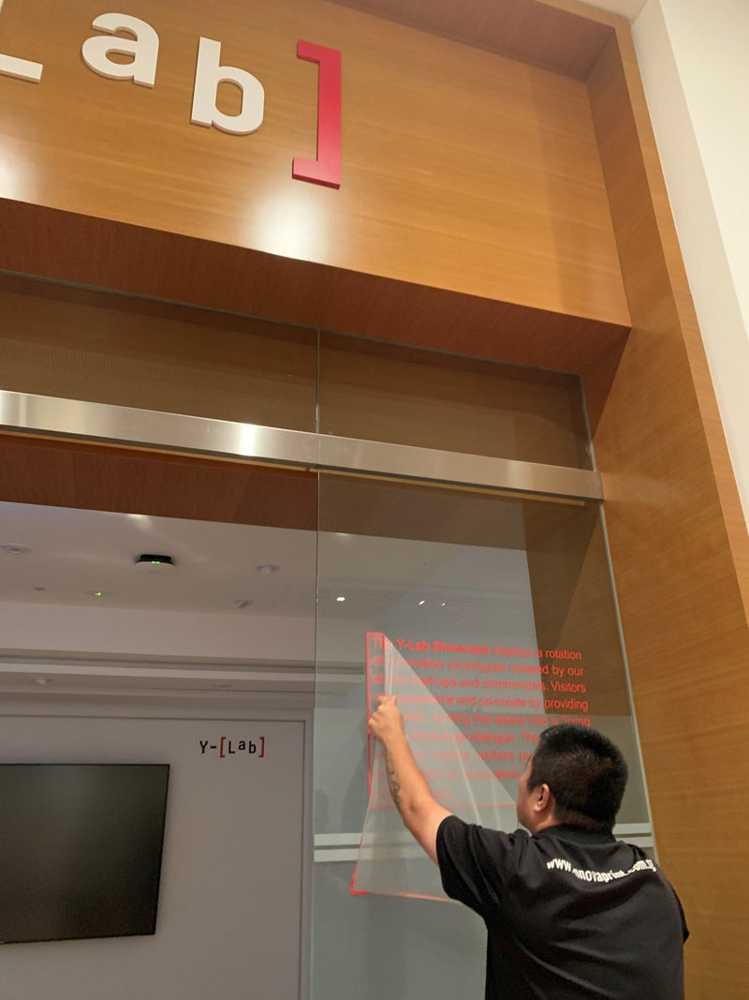
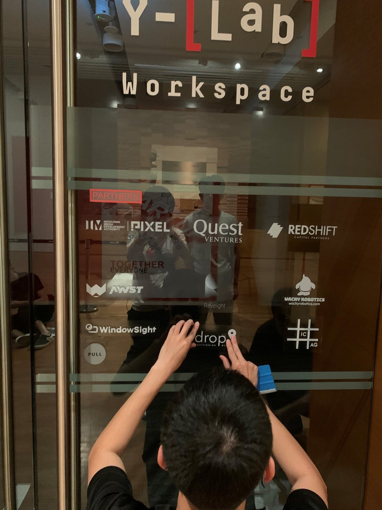

# 社会進歩の比喩としての勾配降下法

人工知能（A.I.）は、私たちの芸術性を際立たせながら差別に対抗する味方になりうる。いや、本当にそうだろうか。歴史から何か学べるとすれば、技術恐怖は古くからある（しかもしぶとい）話であり、技術発展の道筋と社会への影響は、まず一直線には進まないということだ。私たちは最適点を目指して、それぞれの局所的な山に張り付いているが、見通しは悪い。頼れる座標は、いま立っている場所の斜面の急さと、次に進む方向だけである。つまり、ほとんどの機械学習（ML）や深層学習（DL）アプリケーションの中核にある反復的な一次最適化アルゴリズム、[勾配降下法](https://en.wikipedia.org/wiki/Gradient_descent)は、社会進歩を捉える比喩としてかなりよくできている。

話がそれた。ここまでで置いていかれていなければ、技術や道具と私たちの関係をどう位置づけるべきかについての私の立場はこうだ。包丁が人を殺すために使われうるからといって包丁を禁止しないのと同じで、新しい技術のいちばんよい使い方を私たちが（まだ）知らないからといってそれに抵抗すると、風呂の水と一緒に赤ん坊まで流してしまう危険がある。社会は、道具や機械のせいにして逃げがちだ。道具や機械は自分では反論できないし、蔓延している文化や規範を直すより、そちらを直すほうが簡単だからである。それでも私たちは、自分たちをあまりに簡単に免責してしまう。一世代か二世代で物事がどれほど変わりうるかを忘れやすいし、性急な一般化は、帰納の誤謬という穴を自分で掘る以外、どこにも連れていってくれない。

# 何でもかんでも自動化すればいいのか？

ともあれ、私はできるだけ多くのものを自動化したいタイプの人間だ。生産的な怠惰には価値があると信じているからである。効果的に怠けたい、という志があるとき、技術はすばらしい。私がずっとコーディングを学びたかった理由もそこにある。ある日、ガラスの壁にステッカーを貼るために人々がギャラリーへやって来た。そのとき私は、何かが発明されるかどうかを本当に左右するのは、労働コストと資本コストの関係なのだと気づいた。

最初にデザイナーから、立ち会いに来るかと聞かれたとき、私はかなり戸惑った。私の感覚では、せいぜい30分の作業だった。ステッカー貼るだけでしょ。何を監督するの？ 結局、数時間たってもまだ終わらなかった。デザイナーが2人、「施工」担当が2人、それに私。そして「施工」担当の人たちは、同僚が印刷を間違えたせいで別の日に戻ってくる必要があった。私はデザイナーたちと、作品画像のトリミングを自動化した話や、ポスターでのロゴ配置のつらさ（販促物の商業デザインでは、労力の90%がそこに吸い込まれる気がする）を知っていて、あれも自動化できるのではと疑っている話を楽しくしていた。その一方で目の前では、彼らが壁にステッカーを当て、道具と全員の目力で位置が合っているか確認し、水を吹きかけ、ステッカーの上からアイロンをかけていた。そこで私は思った。これは自動化されない気がする。少なくとも、そうした手作業の賃金がホワイトカラーの事務仕事より平均してかなり低い地域では、この種の手仕事は実はオフィスワークよりずっと自動化から安全圏にある。ずいぶん長い逸話になったが、言いたいのはこういうことだ。新しい技術が発明されるか、市場に出るかどうかには、政策とインセンティブが効く。当たり前ですね。

だから私は、効果的に怠けることを信じているし、退屈で反復的で定型的な作業はできるだけ自動化して、人間がもっと創造的になったり、より高次の認知能力を使ったりする余力を取り戻すことが大切だと思っている。そうした自動化や技術がそもそも生まれるかどうかは、労働と資本の相対的なコストに左右されるのだとも気づいた。でも、私たちは本当に何でもかんでも自動化したいのだろうか。効率の向上だけを、社会における新技術の創出と採用を評価する唯一の基準にしたいのだろうか。シンガポール国際財団の Arts for Good Fellowship で、特別なニーズを持つ人々のための協会（APSN）を訪問したあと、私の中に残ったのはその問いだった。

リハビリテーションと作業療法の一環として、APSN は軽度の知的障害のある人たちが働ける「模擬」キッチンのような環境を整えている。包丁を扱うための補助手袋なども用意されていた。私たちは部屋の外に立っていて、彼らが一枚の紙をプラスチックの包装箱に入れ、その箱を次々と積み重ねていくのを見ていた。私が考える、自動化されるべき仕事の条件にぴったり合っていた。自動化できる、退屈で反復的で定型的な作業をできるようになるまで、彼らは3か月かけて学ぶ。これは自動化すべきなのか。直感的に、この問いを立てること自体、この場では間違っていると分かった。それでも、その出来事と出会いは、技術をめぐる主流の議論の中で、人間の生活の多くがどれほど抽象化され、あるいは完全に忘れられているかを私に思い知らせた。上で私は、「退屈で反復的で定型的な作業はできるだけ自動化して、人間がもっと創造的になったり、より高次の認知能力を使ったりする余力を取り戻す」と書いた。そしてその私が、自動化すべきだと主張しているまさにその作業を学ぶのに3か月かかる人たちでいっぱいの部屋の外に立っていたのである。

# 人間の幸福を測る

Smart Nation になろうとする熱意の中で、国内総生産（GDP）への執着の中で、私たちは測定できるものなら本当に何でも最適化してきた。「人生を生きる価値あるものにするもの」だけを除いて。ちなみに、[Environmentally Responsible Happy Nation Index（ERHNI）](https://link.springer.com/article/10.1007/s11205-016-1422-2)の要点もそこにある。念のため。

そこで私の頭の片隅に残る問いはこうだ。片隅に、であって真正面にではない。私の主な関心は今でも哲学や倫理より問題解決に向いているからである。資源配分は、効率性という基準だけでないとすれば、何を根拠に決めればよいのか。実際、効率性（投入1単位あたりの総産出で測られるもの）が唯一の基準なら、いっそ私たち全員をロボットに置き換えればいい。公平性という基準もあるが、私はまだそれについて語れるほど分かっていない。ただ、私の勘では、「非貨幣的な市場」やマッチング経済のようなものが存在する。そこでは、成功とは、その取引を可能にする制度や仕組みがなければ起こらなかったはずのマッチングが実現することなのだろう。[腎臓交換](https://web.stanford.edu/~niederle/Palgrave%20Matching.Approved.pdf)などが思い浮かぶ。

私が[「Clearing the Air on the Environmentally Responsible Happy Nation Index 2016-2018」](https://github.com/erniesg/erhni)という原稿で展開しようとした主張は、希少性の科学であるはずの経済学が、まるで地球には成長のための資源が無限にあるかのように振る舞っているのは皮肉だ、というものだった。幸福をきちんと考慮することは、コミュニティ単位で介入の相対的な成果を比較し、より広い政策分析を補完するための有益なレンズになる。A.I.、自動化、アートその他もろもろに話を戻すと、それらがウェルビーイングに与える影響についての定量研究は、社会的選択を考えるうえで重要である。これはデータサイエンスの重要性と価値を示している。ただし、質的な物語や方法も重要ではないという意味ではない。

# 夢見ることの技法

結局のところ、「知性とは、対立する二つの考えを同時に頭の中に保ちながら、それでも機能し続ける能力」である。データと物語、アートと科学は、一緒に味わえばいい。私たちの内側には多数性がある。私たちは夢見続け、別の未来を作り、これらすべての物質的進歩を、誰のために、どこから作っているのかを問い続けなければならない。アートを武器庫として。

> したがって、人間は創造されて以来初めて、真の、そして永続的な問題に直面することになる。差し迫った経済的な心配から解放された自由をどう使うか。科学と複利が勝ち取ってくれる余暇をどう満たし、賢く、心地よく、よく生きるかである。— ジョン・メイナード・ケインズ

この投稿のタイトルで頭韻を踏みたかったので、反差別の部分についてはまた別の機会に詳しく書く。

---

*初出は PubPub の [erniesg.pubpub.org/pub/eog11k9z](https://erniesg.pubpub.org/pub/eog11k9z)。*
