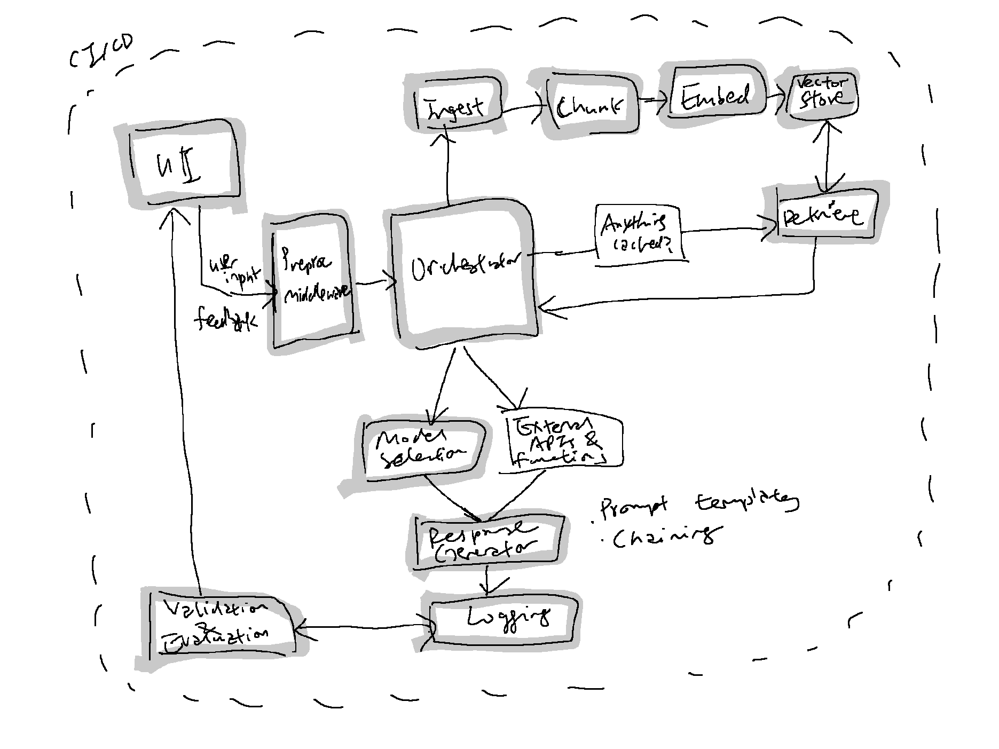

[第 1 部](https://erniesg.pubpub.org/pub/zc0zx741) では、これまでに作った簡単なプロトタイプと、それらがどのように私を、大規模言語モデルベースの製品のための安定し、拡張でき、柔軟でスケールする技術スタックが必要な場所へ導いたかを話した。作るべき面白いものが多すぎるからだ。レジストリと基底クラスによって、提案する A.I. 駆動ソフトウェア群の構成要素を柔軟に差し替え、開発者が協力しやすくする方法を議論した。では最終ユーザー体験はどうか。私が目指す柔軟性とモジュール性には、レジストリパターンとインターフェース駆動設計を組み合わせるのが理想的な方法かもしれない。この投稿では、私が提案する A.I./LLM エンジニアリングスタックを説明する。これはレガシーコードベースのリファクタリング自動化、メールと文書上の知識ベース、ソーシャルメディアコンテンツの生成と公開、オーディエンスがデータを消費する新しい方法など、関心あるすべてのデプロイに一般化できる可能性がある。

先に進む前に、作品注釈の問題に対して従来型ソフトウェア開発と機械学習ベースの方法がどう違うのかを振り返る。

**基準**

**作品の注釈とタグ付けのための従来型ソフトウェア開発**

**作品の注釈とタグ付けのための機械学習ベース開発（例：OpenAI の CLIP）**

**何をするか**

事前定義された規則とメタデータを使って作品に注釈とタグを付ける。

データから学んだパターンを使って作品に動的に注釈とタグを付ける。

**注釈の深さ**

明示的な規則と利用可能なメタデータに限られる。

より広い特徴、テーマ、要素を識別できる。

**適応性**

新しい様式と潮流には手動更新が必要。

再訓練によって新しい様式と潮流に適応できる。

**ユーザー関与**

ユーザーからのフィードバックを手動で組み込む。

モデルの微調整のためにユーザーからのフィードバックを自動で取り込める。

**計算複雑性**

一般に計算負荷は低い。

より深い分析にはより多くの計算リソースが必要。

**解釈可能性**

明示的な規則のため解釈しやすい。

しばしば「ブラックボックス」と見なされ、解釈しにくい。

**対象範囲**

メタデータの可用性と正確性に依存する。

作品の視覚要素を直接扱える。

**手作業**

規則とテンプレートの定義に大きな労力が必要。

モデルが訓練データから一般化できるため、手作業が減る。

アプローチにこのような違いがあるため、A.I. の利点を得たい組織にとっては、ワークフローと開発上の重要な違いに注意を払うことが重要だ。二つの共通点と違いは次の通り：

### **共通点：**

1.  **統合**：機械学習モデルはより大きなソフトウェアシステムの構成要素として機能することが多く、それらは従来型ソフトウェア工学の技法で構築される。
    
2.  **テストと検証**：どちらの方法も、コードやモデルが期待通りに振る舞うかを検証するためにテストを使う。ただし具体的なテスト方法は異なる可能性がある。
    
3.  **配備と保守**：機械学習モデルでも従来型ソフトウェアでも、配備、監視、保守が必要だ。
    
4.  **バージョン管理**：どちらの開発も Git のようなバージョン管理システムで変更と履歴を管理する。ただし機械学習では、データ、モデル、ハイパーパラメータ、結果のバージョン管理も必要になる。
    

### **違い：**

1.  **決定論と確率論**：従来型ソフトウェア工学は一般に決定論的で、明示的な規則と論理に従う。一方、機械学習は確率論的で、データからパターンを学ぶ。
    
2.  **解釈可能性**：従来型ソフトウェアは一般にデバッグしやすく解釈しやすいが、機械学習モデル、とくに複雑なモデルは理解しにくい。
    
3.  **データ依存性**：機械学習は訓練、検証、テストのためにデータへ大きく依存するが、従来型ソフトウェア工学はこれらの段階で本質的にデータを必要としない。
    
4.  **フィードバックループ**：機械学習はモデルが新しいデータから学ぶ継続的フィードバックループを伴うことが多いが、従来型ソフトウェアは本質的にこの特徴を持たない。
    
5.  **技能セット**：従来型ソフトウェア工学と機械学習は異なる技能セットを必要とする。ただし、ソフトウェアエンジニアがよりデータに強くなり、データサイエンティストがソフトウェアのベストプラクティスを学ぶにつれて、重なりは増えている。
    
    -   **機械学習固有の技能**：統計と数学の理解（確率、統計、線形代数、微積分）、データ技能（データクリーニング、前処理、特徴量エンジニアリング、可視化）、モデルの訓練と評価（アルゴリズム選択、ハイパーパラメータ調整、評価指標）、専門的なツールとライブラリ（機械学習フレームワーク、データ処理ライブラリ）、実験能力（A/B テスト、モデルの解釈可能性）を含む。
        

上の例が、A.I. エンジニアリングのアーキテクチャとデザインパターンがなぜそれ自体で新たに生まれつつある技術なのかを、よりよく示してくれることを願う。

# レジストリベース、インターフェース駆動のデザインパターン

オブジェクト指向プログラミング、特に Java、C#、TypeScript のような言語において、「インターフェース」は契約を指定する型定義だ。クラスが実装しなければならないメソッド（場合によってはプロパティ）の集合である。インターフェース自体は実装を含まない。そのインターフェースを実装すると主張するクラスにどんなメソッドが存在すべきかを定義するだけだ。

安定性と実験の柔軟性を必要とする A.I. 駆動または LLM 駆動アプリケーションでは、インターフェースと抽象クラスの使用が特に有益だ。A.I. 開発は多くの実験を伴う。モデルの調整、前処理ステップの変更、異なるデータソースの使用などだ。システムがモジュール性を意識して設計されていれば（インターフェースと抽象設計パターンによって可能になる）、実験のために構成要素を差し替えることがずっと簡単になり、システムの他の部分を壊すリスクも下がる。さらに、A.I. システムを拡張またはデプロイする際、モジュール式設計は安定性と保守性を保証する。

要するに、インターフェースは何を期待できるかについて明確な契約を提供する。

レジストリ、抽象クラス、インターフェースの組み合わせ：

-   機能の種類ごとにインターフェースを持つ（ファイル処理、分割、埋め込み、保存、検索など）。これにより各構成要素が何をすべきかが明確になる。
    
-   レジストリは実行時にこれらインターフェースの適切な実装を管理し、提供するために使える。システムが異なるシナリオや構成に動的に適応できるようにする。
    

たとえば異なるファイル種別を処理する場合を考える：

1.  **インターフェース駆動部分**：
    
    -   まずインターフェースを定義する。たとえばデータを取り込み、メタデータを取得するメソッドを持つ **`DataSource`** インターフェースを考える。このインターフェースは、すべてのデータソース処理器が何をすべきかについて明確な契約を設定する。
        
        ```python
        from abc import ABC, abstractmethod
        
        class DataSource(ABC):
            @abstractmethod
            def ingest(self):
                pass
        
            @abstractmethod
            def get_metadata(self):
                pass
        ```
        
2.  **レジストリ部分**：
    
    -   データが取り込まれると（たとえば Git リポジトリからのファイル）、システムは **`FILE_TYPE_PROCESSORS`** レジストリを参照して、各ファイル拡張子に基づく適切な処理器を見つけられる。
        
        ```text
        FILE_TYPE_PROCESSORS = {
            ".py": PythonFileProcessor,
            ".md": MarkdownFileProcessor,
            # ...
        }
        ```
        

システムがデータを取り込む必要があるとき、このレジストリを照会して各ファイル拡張子に基づく適切な処理器を見つけられる。

3.  **`DataSource` サブクラス内の統合ワークフロー**：
    
    -   **`DataSource`** サブクラスの中では、この二つの手順をまとめられる。まずデータを取り込み、その後各取り込み済みファイルに適切なファイル処理器を使う。
        

```python
class GitRepoSource(DataSource):
    def ingest(self):
        files = self._clone_and_filter_files()
        processed_data = []
        
        for file_path in files:
            ext = self._get_file_extension(file_path)
            processor_class = FILE_TYPE_PROCESSORS.get(ext)
            if processor_class:
                processor = processor_class()
                processed_data.append(processor.process(file_path))
                
        return processed_data
```

### **組み合わせの利点**

この組み合わせにはいくつか利点がある：

1.  **容易な拡張**：将来新しいデータソース種別をサポートする必要が出た場合、**`DataSource`** インターフェースに従う新しいクラスを作り、**`DataSourceRegistry`** に登録するだけでよい。既存コードに触れる必要はない。
    
2.  **明確な期待値**：**`DataSource`** インターフェースは、すべてのデータソースが共通 API に従うことを保証し、取り込みパイプラインの振る舞いを予測可能にする。
    
3.  **動的な適応性**：中央レジストリがあれば、異なるデータソース処理器を主ワークフローに影響させずに簡単に交換でき、大きな柔軟性が得られる。
    

文書と PDF 用のエージェントとコードリポジトリ用のエージェントのように、異なるエージェントを持つ多様な利用場面では、この組み合わせはインターフェースによる明確な契約を提供しながら、レジストリによって拡張または適応する能力を保持する。安定性はインターフェースから、柔軟性はレジストリから来る。

A.I./LLM ベースのアプリに新しい能力を与えたいときはどうなるのか？

### **相互作用と消費方法の拡張：**

例として、私が “[The Sound of Stories](https://www.youtube.com/watch?v=0cBbG0SkSCo)” でやりたいことを考える。追加の消費方法として多言語ナレーションを行うために、大規模言語モデルが生成したテキストを解析することだ。生成された物語に基づく[画像生成を有効に](https://www.activeloop.ai/resources/ai-story-generator-open-ai-function-calling-lang-chain-stable-diffusion/)したいかもしれない。消費は他のツールや人によって行える。私の想定する利用場面であるソーシャルメディアコンテンツ生成では、ソーシャルメディア API が消費する構造化された `.json` を出力する必要もある。レジストリベース、インターフェース駆動型のアプローチにより、下のように消費方法を拡張できる。

1.  **レジストリを作る**：前の例と同じく、消費方法（テキスト表示、音声出力、アニメーション動画など）のレジストリを持てる。
    
2.  **消費インターフェース**：
    

```python
class ConsumptionInterface(ABC):
    
    @abstractmethod
    def display(self, content):
        pass
```

3.  **具体的な実装**:
    

```python
class TextDisplay(ConsumptionInterface):
    def display(self, content):
        # Simply print the content

class VoiceOutput(ConsumptionInterface):
    def display(self, content):
        # Use Text-to-Speech to vocalise the content

class AnimatedVideo(ConsumptionInterface):
    def display(self, content):
        # Convert content into animated video
```

では一歩引いて、AI アプリケーションのデータ駆動開発サイクル全体をエンドツーエンドで見てみよう。

# A.I. アプリのための汎用的で簡略化したエンドツーエンドアーキテクチャ

A.I./LLM アプリスタックはまだ立ち上がり始めた段階で、[a16z は非常に有用にも](https://a16z.com/2023/06/20/emerging-architectures-for-llm-applications/) それを、プロンプト構築（検索）、プロンプト実行（推論）、そしてエコシステム内のいくつかのツール段階を中心に構造化している。データフローとパイプラインはこのエコシステムのバックエンド配管であり、従来型ソフトウェア工学とのもう一つの重要な違いでもある。下に、私が簡略化した汎用アーキテクチャと開発上の重点構成要素を示す：



### **例：作品のニューラル検索の流れ**

以前、私は[作品のニューラル検索デモ](https://www.youtube.com/watch?v=x373QM6uHY8)を作った。このデモを本番環境向けに拡張するには、下の手順が含まれるだろう。

**手順**

**関係する構成要素**

**動作**

**備考**

1

Orchestrator

作品メタデータと画像埋め込みの初期取り込み

バッチモード処理

2

User Interface (UI)

ユーザーが検索クエリまたはフィルタ条件を入力

  

3

Main Application

ユーザー入力を検証し、設定を取得

Checks with Configuration Manager

4

Orchestrator

ベクトルデータベースから関連する埋め込みを取得

Possibly uses Retrieval Engine

5

Response Generator

ユーザーにわかりやすい出力を構成

表示用に作品メタデータと画像を整形

6

Logging Module

処理を記録

ユーザーのクエリ、応答時間などを保存

7

Validation & Evaluation

結果を自動評価

基本的なセキュリティチェック

8

User Interface (UI)

ユーザーに検索結果を表示

  

9

Feedback Collector

ユーザーからのフィードバックがあれば収集

  

# 4 か月開発ロードマップの優先順位

この汎用フレームワークとアーキテクチャの中で、私が関心を持つことはたくさんある：

-   作品のニューラル検索
    
-   生成された物語のリアルタイム多言語ナレーション
    
-   コードベースのリファクタリングとテスト作成
    
-   文書とデータに基づく知識ベースとの対話
    
-   コード生成
    
-   ソーシャルメディアコンテンツの生成と公開
    

優先順位を決めるにあたり、読解と創造的な文章作成は二つの異なる技能であり、前者は後者にとって非常に価値があると考える。そこで私の計画は、大規模言語モデルに学ぶことを教えるのを優先し、作品のニューラル検索や知識ベースのような複雑度の低い利用場面から始めることだ。大まかな時程は次のように進むかもしれない：

-   **1-2 か月目**：**作品のニューラル検索** - 基礎的なデータパイプラインのため。
    
-   **2-3 か月目**：**文書とデータに基づく知識ベースとの対話** - 取り込みと検索の方法、UI コンポーネントを開発するため。
    
-   **3-4 か月目**：**コードベースのリファクタリングとテスト作成** - 知識ベース対話フェーズで得た洞察と方法を活用し、より賢い自動テストとリファクタリングを行う。
    

上記を踏まえると、ニューラル検索と知識ベースの構築に集中しているとしても、大規模言語モデルを使って自分たちのコードベースに問い合わせ、それをコード品質サービスに渡し、プロンプトテンプレートを連結または利用して、リファクタリングやテスト作成のような関連自動化を行う簡略化したワークフローを始めるとよさそうだ。最初は手動レビューのためにブランチへ分け、その後すべてのテストが通れば自動化できる。

一方で、[自分の Git リポジトリ](https://github.com/erniesg/berlayar) ではプロジェクトをこのように整理しようとしている。さらに発展すると予想しているので、下はまだ作業中だが、各フォルダは次のような役割を持つと考えている：

-   db - CRUD など、すべてのデータベース関連操作
    
-   demos - いくつかの「安定した」デモとワークフローを定義する場所
    
-   gui - ユーザーが見るすべてのもの
    
-   src - インターフェースと実装の大部分のソースコード
    
-   テスト - 単体テストと統合テスト、そしてテスト用 fixture
    

まだ CI/CD、監視、評価の構成要素が不足しており、プロジェクト構造も整理中だ。ただし他の開発者と分担できればと思っている。というのも、[National Arts Council Arts x Tech Lab](https://www.nac.gov.sg/singapore-arts-scene/technology-and-innovation/arts-x-tech-lab) のために “[The Sound of Stories](https://www.youtube.com/watch?v=0cBbG0SkSCo)”（リアルタイムで、生成された物語を多言語で語る仕組み）も届ける必要があるからだ。うまくいけば、これらの開発努力は高い相乗効果を生み、Berlayar A.I. という会社のための基礎ブロックを与えてくれるはずだ。;)

```text
├── agents
│   └── __init__.py
├── dataloader.ipynb
├── db
│   ├── chunks.py
│   ├── connectors.py
│   ├── __init__.py
│   ├── main.py
│   ├── ops
│   │   ├── deeplake.py
│   │   └── __init__.py
│   └── utils.py
├── demos
│   ├── chat_adf
│   │   ├── chat.py
│   │   ├── tests.py
│   │   └── utils.py
│   ├── neural_search
│   │   └── upload.py
│   └── thesoundofstories
│       ├── audio
│       └── chat.py
├── diagram.py
├── gui
│   └── __init__.py
├── ingest_pdf.log
├── __init__.py
├── log_init.py
├── main.py
├── notebooks
│   ├── architecture.ipynb
│   ├── chat_adf.ipynb
│   └── dataloader.ipynb
├── poetry.lock
├── pyproject - Copy.toml
├── pyproject.toml
```

一方で、私はこれをいったん保留し、近づいている “[Good Economics for Bad Times](https://mitxonline.mit.edu/courses/course-v1:MITxT+14.009x/)” の試験に集中する。

---

*Originally published on PubPub at [erniesg.pubpub.org/pub/wpnv7rhs](https://erniesg.pubpub.org/pub/wpnv7rhs).*
