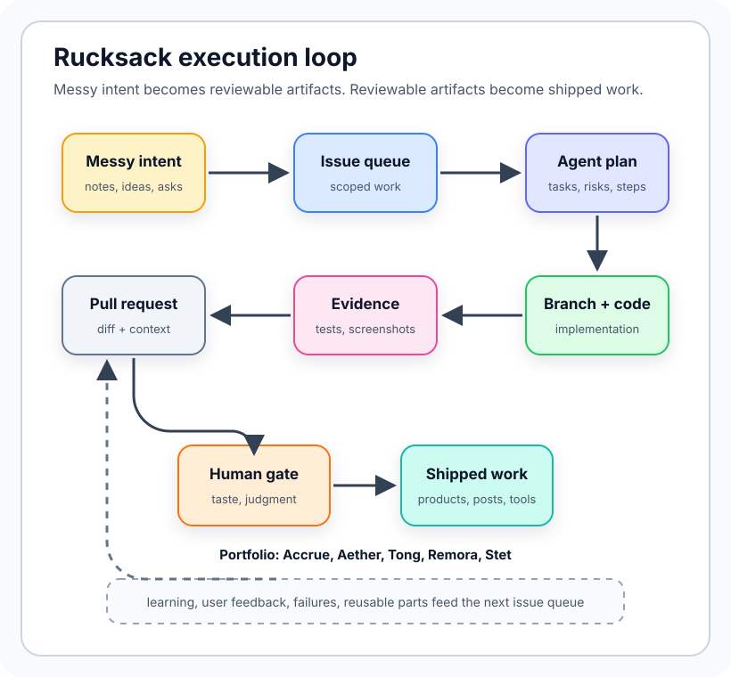

아직 그럴듯하게 보일 만큼 아무것도 정리되지 않은 시점에 이 글을 쓰고 있다. 아마 그게 핵심일 것이다.

목표는 말하기엔 단순하지만 달성하기엔 단순하지 않다.

**$1M USD ARR을 만들 때까지 공개적으로 만들어 가고 싶다.**

더 정확히 말하면, AI-native 제품, 시스템, 실험들의 포트폴리오를 만들고 싶다. 그중 하나, 혹은 여러 개의 조합이 실제 자유를 줄 만큼 경제적으로 의미 있는 수준이 될 때까지.

$1M ARR은 약간 터무니없는 숫자다. 손에 현금 $1M이 있다는 뜻도 아니다. 안정적인 월급과도 다르다. 안전과도 다르다. 하지만 숫자는 유용하다. 흐릿한 욕망을 명확하게 만들기 때문이다.

지금 내 사고의 틀은 이렇다. 언젠가 내가 부모가 되는 길을 선택한다면, 내 삶의 질을 낮추지 않고 그 선택지를 행사할 수 있도록 대략 **손에 $1M**이 있거나 최소한 **안정적인 월 5자리 수입**이 있었으면 한다.

나는 점점 부모가 된다는 일에 호기심이 생기고 있다. 귀여운 라이프스타일 액세서리로서도 아니고, 곧 뭔가 발표하겠다는 뜻도 아니다. 오래 열어 두고 싶은 진지한 장기 선택지로서다. 아이는 사이드 프로젝트가 아니다. 가족은 Notion 템플릿이 아니다. 언젠가 그 책임을 선택한다면, 공황이 아니라 여유가 있는 위치에서 하고 싶다.

물론 현실적으로는 다른 누군가와 함께 삶을 만들고 싶다. 가족 안에서 거친 개인주의를 연기하려는 것이 아니다. 하지만 나는 계속 단일 소득 가구의 스트레스 테스트 관점에서 생각한다. 견고성의 완충 장치가 필요하기 때문이다. 소득 하나가 사라져도, 돌봄이 늘어나도, 누군가 시간이 필요해져도, 삶이 늘 그렇듯 예기치 않게 흘러가도 계획이 여전히 작동했으면 한다.

물론 원하는 것은 끝이 없다. 쾌락 적응은 실제다. 오늘 안전하게 느껴지는 숫자가 내일은 우스울 만큼 부족하게 느껴질 수도 있다. 하지만 지금은 이것이 내 프레임이다. 객관적으로 맞아서가 아니라, 내가 향해 만들 방향을 주기 때문이다.

## 왜 지금인가?

거시적으로 나는 더 이상 세상의 시스템들이 내 최선의 이익을 돌보도록 만들어졌다고 믿지 않는다.

이건 극적인 반제도 선언문이 아니다. 나는 여전히 공공재를 믿는다. 결함 있는 시스템 안에서 일하는 좋은 사람들을 여전히 믿는다. 많은 일은 개인보다 집단적으로 해결하는 편이 낫다고 여전히 믿는다.

하지만 세 번째 유럽 여행 이후, 내 안의 무언가가 바뀌었다.

묘하게 환멸을 느꼈다. 유럽이 하나의 단일한 무엇이어서도 아니고, 아시아가 마법처럼 더 나아서도 아니며, 캐리어와 Google Maps를 들고 돌아다니다가 거대한 문명적 진실을 발견해서도 아니다.

오히려 이런 느낌이었다. 세상이 갑자기 표지판이 형편없는 횡단보도들의 연속처럼 느껴졌다. 안전한 길이 있다고 말해 준다. 다리가 존재한다고 말해 준다. 누군가 공학 검사를 했다고 말해 준다. 그런데 도착해 보면 모두가 즉흥으로 움직이고 있다. 표지는 낡았고, 지도는 정치적이며, 책임자들은 지쳐 있고, 틀렸을 때의 비용은 매우 불균등하게 분담된다.

나는 제도들이 악하다고 생각하지 않는다. 다만 제도들은 자주 느리고, 자기보호적이며, 한 사람의 삶이 가진 정확한 형태와 어긋난다고 생각한다.

그리고 내가 일, 가족, 지리, 건강, 돈, 미래에 관한 선택을 해야 한다면, 내가 잘 착지하는지 신경 쓸 수도 있고 아닐 수도 있는 시스템들의 하류에 있고 싶지는 않다.

그래서 이건 사실 부자가 되는 이야기가 아니다.

선택권을 사는 이야기다.

공황 없이 부모가 될 선택권. 아니라고 말할 선택권. 월세 때문이 아니라 중요하기 때문에 일할 선택권. 싱가포르, APAC, 그리고 일이 나를 데려가는 어디든 오갈 선택권. 돌봄의 모든 행위를 재정 스트레스 테스트로 만들지 않고 사람들을 돌볼 선택권.

돈은 행위 능력의 유일한 형태는 아니지만, 매우 휴대하기 쉬운 형태다.

## 나의 출발점

나는 부유한 부모를 두지 않았다. 나는 가족 중 첫 세대 대학 졸업자다. 창업이 패밀리 오피스의 자산 배분 전략인 배경에서 오지 않았다.

그렇다고 가난 cosplay를 하고 싶지도 않다.

나는 복리로 쌓이는 많은 작은 이점의 혜택을 받았다.

AI 용어로 말하면, 나는 **무조건적인 사랑으로 사전 훈련**되었다. 낙관으로 기우는 성향과 STEM에 대한 자연스러운 기질을 가지고 자랐고, 싱가포르의 시스템은 마침 그것을 보상했다. 노력하는 일이 종종 기회로 바뀌는 환경에 있었던 것은 행운이었다.

그다음에는 **RLHF**가 있었다. 학교, 시민사회, 멘토, 커뮤니티, 프로젝트, 보조금, 뉴스룸의 혼란, 박물관 실험, hackathon, 인터넷 친구들, 그리고 시간이 지나며 나를 조금 덜 틀리게 만들어 준 많은 사람들.

그리고 지금은 **test-time compute**가 있다. 모호함과 함께 앉아 있는 능력, 문제를 끝까지 추적하는 능력, 도구를 공격적으로 쓰는 능력, 여러 영역을 넘나드는 능력, 불안을 산출물로 바꾸는 능력.

그러니 아니다, 나는 "self-made"가 아니다. 누구도 그렇지 않다.

하지만 어쩌면 그래서 이 여정을 기록하는 일이 더 유용할지도 모른다. 나는 0에서 시작하지 않지만, 신탁기금에서 시작하는 것도 아니다. 나는 이상하리만큼 구체적인 장점, 빈틈, 상처, 기술, 취향, 망상의 묶음에서 시작한다.

아마 많은 사람이 그런 곳에서 시작할 것이다.

## 어떻게 만들 계획인가

첫 번째 원칙은 이렇다.

**그것을 만드는 것을 만드는 것.**

어떤 단일 제품에 집착하기 전에, 나는 나만의 실행 시스템을 만들고 싶다.

나에게 그것은 **Rucksack**에서 시작한다. 지저분한 의도를 출시된 작업으로 바꾸기 위한 issue-to-PR autopilot / human-gated 에이전트 system이다. 판단을 대체하려는 것이 아니다. 활성화 에너지를 낮추려는 것이다.

아이디어가 issue가 되고, issue가 branch가 되고, branch가 PR이 되고, PR이 증거를 모으고, 나는 인간 판단이 실제로 중요한 지점에만 loop 안에 남아 있는 시스템을 원한다.

왜냐하면 병목은 더 이상 단순히 "내가 이걸 코딩할 수 있나?"가 아니기 때문이다.

병목은 이것이다. 무엇이 중요한지 결정할 수 있는가? 컨텍스트 스위칭 중에도 계속 움직일 수 있는가? 줄거리를 잃지 않고 여러 실험을 돌릴 수 있는가? 나를 더 다작하게 만들면서 더 혼란스럽게 만들지는 않는 기계를 설계할 수 있는가?

Rucksack은 인프라 레이어다.

루프는 어떤 단일 자동화보다 중요하다. Rucksack이 작동한다면, 흐릿한 의도를 review 가능한 산출물로, 그리고 review 가능한 산출물을 다른 모든 베팅에서 출시된 작업으로 바꿔 줄 것이다.

그다음은 sidequest들이다.

### Accrue

Accrue는 지루하지만 잠재적으로 유용한 쪽이다. 회계, 장부, 인보이스, 분류, Xero 스타일 통합, 그리고 심각한 재무나 규제 관련 작업에 닿기 전의 인간 review gate를 위한 AI 작업 흐름다.

가장 섹시한 표면은 아니다. 바로 그래서 중요할 수 있다. 지루한 작업 흐름에는 예산이 있다. 회계사들에게는 고통이 있다. 반복 오류에는 경제적 비용이 있다. AI가 지저분한 중간 영역을 더 신뢰 가능하게 만들 수 있다면, 여기에 진짜 비즈니스가 있을지도 모른다.

### Aether

Aether는 창작 운영에 더 가깝다. 디자인, 콘텐츠, social listening, key visual 전파, 다국어 적용, 그리고 17개의 끊어진 도구 없이 팀이 더 일관된 창작물을 만들 수 있도록 돕는 문제다.

여기는 내 미디어, 뉴스룸, AI, 디자인 본능이 충돌하는 지점이다. 아직 이것이 제품인지, studio system인지, 내부 도구인지, 나중에 제품이 될 작업 흐름들의 묶음인지 모른다. 하지만 고통이 실제라는 것은 안다.

### Tong

Tong은 나의 언어 / 문화 / 학습 세계다.

나는 계속 다국어, 문자, 이야기, 중국어, 영어, 번역, 기억, 그리고 사람들이 실제로 상징 체계 사이를 오가며 배우는 방식으로 돌아온다. Tong은 CJK 학습 제품, 내러티브 게임, AI tutor, 혹은 더 이상한 무언가가 될 수 있다.

Accrue보다 명확하게 수익화되지는 않을 가능성이 크지만, 내 영혼에는 더 가깝다. 그래서 포트폴리오에 남는다.

### Remora

Remora는 애착, 레버리지, 더 큰 시스템 위에 올라타는 작은 시스템의 궤도에 있다.

나는 이 은유를 좋아한다. 유용한 소프트웨어의 많은 부분은 거대한 것을 대체하는 일이 아니기 때문이다. 기존 작업 흐름 주변의 어색하고 마찰이 큰 표면을 찾아, 거기에 충분한 지능을 붙여 전체가 더 잘 움직이게 만드는 일이다.

Remora가 제품이 될지, 통합의 한 종류가 될지, 포트폴리오 전반의 반복 패턴이 될지는 아직 모른다. 하지만 여기 속한다. 그 본능이 중요하게 느껴지기 때문이다. 배포, 의존성, 작업 흐름의 중력이 이미 존재하는 곳에 만들기.

### Stet

Stet은 이 집의 편집 / 수정 / 출판 쪽이다.

그 단어 자체는 "그대로 두라"는 뜻이고, AI가 무한한 초안을 만들어 낼 수 있지만 여전히 희소한 것은 판단인 세계에 잘 맞는다. 무엇을 바꿔야 하는가? 무엇을 복원해야 하는가? 무엇을 그대로 두어야 하는가?

이것은 포트폴리오에서 나를 계속 글쓰기, 편집 시스템, 버저닝, 취향, 그리고 산출물을 출판 가능한 무언가로 바꾸는 마지막 단계의 인간 결정으로 끌어당기는 부분이다.

### 새로운 AI-Native 실험

그리고 새로운 것들이 생길 것이다.

규칙은 "이미 이해한 것만 만들기"가 아니다. 규칙은 그럴듯한 수익화 가능성을 가진 AI-native 제품을 계속 탐색하는 것이다.

AI-native는 "chatbot 추가"를 뜻하지 않는다. 모델, 에이전트, 검색, 생성, multimodal 인터페이스, 적응형 작업 흐름 없이는 현재 형태로 존재할 수 없는 제품이라는 뜻이다.

어떤 실험은 너무 이를 것이다. 어떤 것은 어리석을 것이다. 어떤 것은 좋지만 비즈니스는 아닐 것이다. 어떤 것은 비즈니스지만 나에게 맞지 않을 것이다.

괜찮다.

핵심은 내 상상만이 아니라 현실에서 배우고 있는지 확인하면서, 행운을 만날 표면적을 늘리는 것이다.

## 무엇을 공유할 것인가

나는 이것이 연기하는 founder 콘텐츠가 되기를 원하지 않는다.

그래서 숫자는 조용히 피하면서 매일 "shipping hard"에 관한 동기부여 글을 올리겠다고 약속하지 않겠다.

내가 공유하고 싶은 것은:

- 내가 무엇을 만들고 있는지
- 무엇을 shipped했는지
- 무엇이 망가졌는지
- 사용자가 무엇을 말했는지
- 작동할 줄 알았지만 작동하지 않은 것
- distribution에 대해 배우는 것
- pricing에 대해 배우는 것
- AI-native product design에 대해 배우는 것
- 시스템을 돌리는 시스템으로서의 나 자신에 대해 배우는 것

공유할 만한 매출이 생기면 아마 공유할 것이다. 막다른 길도 공유할 것이다. 막다른 길도 데이터이기 때문이다.

목표는 필연적으로 보이는 것이 아니다.

목표는 경로를 검사 가능하게 만드는 것이다.

## 왜 공개적으로 만드는가?

나는 책임감을 원하지만, 유독한 종류의 책임감은 원하지 않기 때문이다.

매일 낯선 사람들이 "ship it"이라고 외쳐 줄 필요는 없다. 공개적인 결정, 실험, 증거의 흔적이 필요하다. 뒤돌아보고 무엇이 바뀌었는지 볼 수 있어야 한다.

또한 "아이디어가 너무 많은 AI engineer"에서 "수익성 있는 인공지능 네이티브 제품 포트폴리오"로 가는 경로가 점점 더 흔해질 것이라고 의심한다.

모두가 venture capital을 받고 싶어 하지는 않는다. 모두가 50명짜리 팀을 관리하고 싶어 하지는 않는다. 모두가 취업과 창업을 서로 배타적인 종교처럼 두고 선택하고 싶어 하지는 않는다.

우리 중 일부는 작고 강력하며 수익성 있는 시스템을 만들고 싶다.

우리 중 일부는 작업 가까이에 머물고 싶다.

우리 중 일부는 AI를 제품 레이어로만 쓰는 것이 아니라, 살아가는 방식의 레버리지로 쓰고 싶다.

## Day 0

그래서 이것이 Day 0이다.

거창한 런칭은 없다. 반짝이는 landing page 제국도 없다. "자는 동안 $37,421을 벌었다"는 스크린샷도 없다.

그저 모래 위에 그은 선 하나.

나는 $1M USD ARR을 만들 때까지 공개적으로 만들어 가고 싶다.

첫 세대 대학 졸업자이자, 싱가포르의 형태를 가진, AI-pilled되고, 시스템에 집착하며, 가끔 망상적인 builder가 도구, 취향, 고집의 묶음을 진짜 경제적 자유로 바꿀 수 있는지 알고 싶다.

기계가 기계를 만들 수 있는지 보고 싶다.

그리고 작동하는 부분을 누군가가 재사용할 수 있을 만큼 전체를 명확하게 기록하고 싶다.

인공지능 네이티브 제품를 만들고 있거나, 회계나 창작 작업 흐름의 고통을 겪고 있거나, 중국어를 배우고 있거나, 부모 됨과 돈에 대해 생각하고 있거나, 누군가가 실존적 불안을 shipping velocity로 라우팅하는 모습을 지켜보고 싶다면 함께 따라와 달라.

이것이 시작이다.
