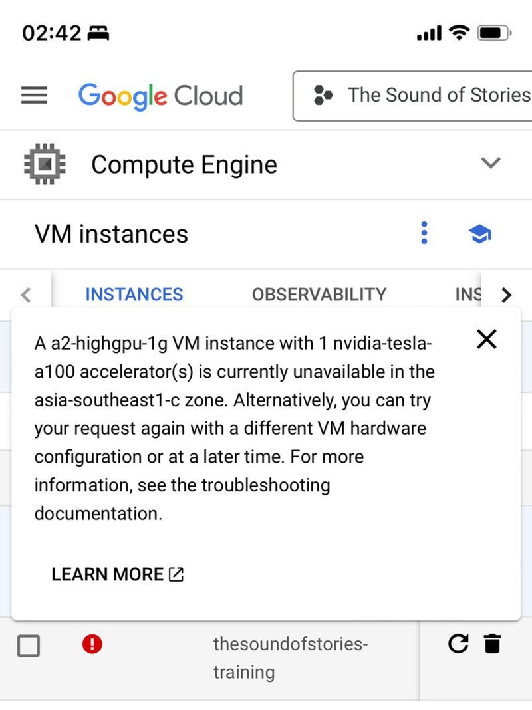

午前 2:42、ベッドに横になりながら、これ以上オフピークな時間なんてないだろうし、寝る前にちょっと確認するくらい何の害があるんだ、と思っていた。そこでスマホで GCP を開き、A100 VM を取ろうとしたら……

これはダイヤルアップ以前の時代よりひどい。あの頃でさえ、家にインターネットが来る前は、図書館で小遣いが許す限りネットを使えた。どうやら最初のモデル訓練は楽勝でも、技を磨いて最後の一歩を詰めるのは別問題らしい。私は今、同じ壁に十分頭をぶつけたところで、得られるものと痛みの比率があまりに釣り合っていない。だからいったんピッチとショーケースのモードに切り替え、そのあと第一原理に戻って取り組もうと思っている。つまり論文を読み、モデルアーキテクチャのレベルまで降りるということだ。とはいえ、GPT-4 と一緒にコードを書くことで、木曜日には Chainlit と Ngrok で “The Sound of Stories” を全デバイスに出せたのは本当に気に入っている。その後、金曜夜のユーザーテストでマルチユーザー問題にぶつかり、Chainlit UI は人が使うにはかなり重いと気づいたので、Flask バックエンドで提供する WhatsApp 上に載せた。さらに土曜朝に調べて、FastAPI と Uvicorn の方がはるかに高性能で、非同期メソッドとバリデーションを扱えると分かった。これは私にとって重要な差別化要因だった。なぜなら：

1.  待つ理由がない
    
2.  データエンジニアリングの 90% は型バリデーションの修正、というより、私以外のソースから来る型バリデーション不足の修正だ、という話をしてほしい…… :)
    

下のデモはすべて、私の携帯でリアルタイムに録画したものだ。ところどころまだ目に見える遅延はあるが、どれも本番環境では直せる。全体として、ここまで進めてきたことと、ここまで学んだことにはかなり満足している。私はプロジェクトやコミッションを、自分の時間を生産的に使わせる強制装置として見る傾向がある。余暇をこれに使っていなければ、ゲームか Netflix をしていただろうし……それでいい。以下では、A.I. と LLM で作る中で得た学びと考えを書いていく。

<iframe alt="The Sound of Stories WIP (Mobile)" src="https://www.youtube.com/embed/dKqtKKXI0w8?feature=oembed" aria-describedby="nny38rsz3pw-figure-caption" allowfullscreen="true" style="width: 100%; aspect-ratio: 16 / 9; height: auto; border: 0; "></iframe>

The Sound of Stories WIP (Mobile)

## 今回は本当に違う

本当に違う。これだけで独立した記事にする価値があるほどだ。今のところのざっくりした要約は、人類史上初めて、私たちは知能を商品化している、ということだ。道具を使う動物である私たちが、社会として A.I. を効果的に活用できるなら、それはがんの治療や無限のクリーンエネルギーへの鍵になると本気で思う。偉大な平準化装置になり、すべての人に自分専用の Jarvis や Gundam を与え、人生の中でいくつもの役割を担わせられる。ChatGPT は、ある種の哲学的な壁打ち相手であり、ときには驚くほど治療的な論理学者であり、万能の家庭教師であり、親切で熱心だが冗長すぎる助手であり、何も分かっていないインターンであり、何よりも自分の思考の拡張になっている。すでに持っている以上の腕、知識、情報へのアクセスを、人工的に増やしてくれる。Gemini 1.5、Groq、Sora がどんな新しい能力を解き放つのか、待ちきれない。

## イノベーションには開放性が必要。それだけ。

これに関して、私にはいくつか個人的な出来事がある。一つ目は、2022年7月に [GPT-3 の早期開発者アクセス](https://www.instagram.com/p/CgWkVnHv6Tg/?img_index=1) を持っていて、それを使って Xi Jinping についてのラップを書き、その後はほとんど使わなかったことだ。ChatGPT が一般公開され、世界中の非常に多くの人たちによる探索が一気に爆発して初めて、私は彼らの実験から恩恵を受け、ChatGPT を効果的に使うことを学べた。この小さな出来事は、予定していたユーザーテストの数日前に、自分のコードが壊れた出来事とも並べて考えられる。私が手癖で仮想環境を削除してしまったからだ。Docker デプロイのためにすべてをきれいに設定しようとしていたのだが、LangChain &lt;> OpenAI &lt;> Chainlit の間でありとあらゆる依存関係の衝突が起こり、それを本当に手作業で一つずつほどいていた……。自動で動くバージョン番号を簡単に見つける方法がないことにも苛立ったし、2000 万ドルの資金を得たソフトウェアが、2023年11月7日にリリースされた OpenAI 1.0.0 にまだ対応していないことにも呆れた。ともあれ、最終的には動かせた。でもあの痛みは二度と経験したくない。

GPT-4 が落ちている日は、自分の生産性が落ちる日だ。だから M2 Max でローカル LLM を動かし、Gemini Advanced に登録しようとし続けている（成果なし zzz）。競争、代替手段、オープンソースはイノベーションに良い。企業が規制の取り込みやレントシーキングではなく、革新を続けるための圧力になるからだ。

より技術的な面では、CI/CD、Docker、マイクロサービスアーキテクチャについて、確実に手触りのある理解が増えてきていて楽しい。さらに消費者に直接届くよう、WhatsApp と WeChat ミニプログラム上で作り込んでいくのも楽しみにしている。次の更新では、Google CoLab で自分の RAVE モデルを無料で訓練する方法についてチュートリアルを録画し、技術的な学びをもう少し詳しく話すつもりだ。

---

*PubPub の [erniesg.pubpub.org/pub/7b4nk0ao](https://erniesg.pubpub.org/pub/7b4nk0ao) で初出。*
