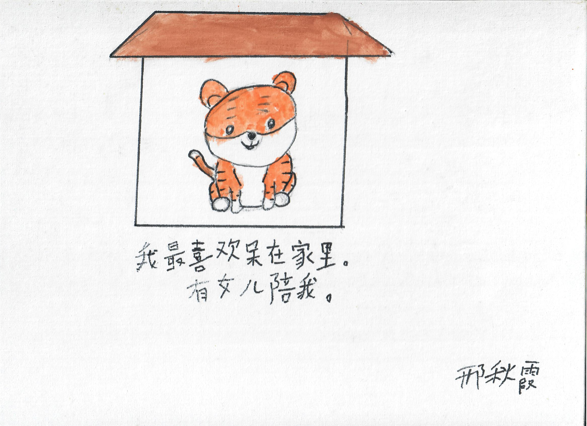

你有没有听过比一颗心停止跳动更巨大的寂静？我听过。当一口气接着一口气之间的停顿被越拉越长，我看着那个给了我生命的人，躺在那里，再也没有生命。生与死之间的那条线是阈限的。就像我当时最微弱的一个念头：如果我能和她、和她闭上的眼睛一起潜入最深的深处，生命也许还能继续，就像她只是睡着了。不是死去。永远没有离开。只是去了某个很远的地方，超出我的触及。就像我在海外，而她在家时的我。我几乎没有联系她，因为我忙着在外面的世界生活。她也许在别处过着更完整的人生，而我并不知道。她应该拥有那样的人生。

后悔的递归回响，在缓解的遐想中鸣响。

> 我有一幅她画的画，上面写着：“I like staying at home the most. Got my daughter keep me company. （我最喜欢呆在家里。有女儿陪我。）”

但我失去了她。我确实失去了她。而我想她。我是什么时候开始想她的？是在医生建议 Y-90，然后是 sorafenib 的时候吗？因为那时我知道，无论哪种治疗，都不存在一个妈妈能永远和我在一起的选项。还是更早，在我出生之前就意识到，无论她违背所有人的建议嫁到海外会面对多少艰难，她都会做完全相同的选择？

只是一个 1962 年 7 月 4 日出生在海南的小女孩。她在我现在这个年纪，在新加坡学着说普通话，翻着《联合早报》找不需要正式教育的工作，好让她的孩子拥有她甚至不敢梦想的机会。

这些日子里，我在发现自己似乎不可能原谅自己的同时，也偶尔瞥见她曾经是多么爱我。我怎么可能原谅自己？

自从妈妈去世以后，我从来没有像现在这样更快乐、更健康，也从来没有因为失去她而更悲伤。因为她供我受教育，我可以用余弦距离计算文本的相似度，却找不到我失去的积分。我转身避开痛苦。不断说出“我”，接着又一个“我”，这很奇怪，因为你和我 - 我们，在宇宙中同样微不足道。我所说的这个“我”，这个“我”，这个我以为自己用来体验世界的唯一视点，是由一种如此无边无际、如此无限的爱带到这个世界上的。我根本无法开始理解，任何存在为什么、又如何能对另一个存在怀有这样的爱。

除非我以正交的方式逼近它，比如想象我会如何对待更年轻的自己。那让我哭得像一个刚从母亲子宫里被撕开的新生儿；这很奇怪，因为这并不是我正在感受到的悲伤，至少不是围绕着我失落感的那种悲伤，为什么会让我哭得那么厉害？

不得不承认，这是最纯粹形态的痛苦。除了失去妈妈的痛之外，这是我一直挡在外面的另一种痛苦轮廓。

也许这就是人们所说的，爱另一面的痛苦；爱就是变得脆弱。爱、脆弱和痛苦是一体又彼此相生。我若否认这份痛苦的全部，并不是在帮自己。因为它的全部，就是我曾经被爱的程度，而我正在慢慢学习把它带向前方。

如果失去是我们为爱付出的代价，而后悔是它的利息，那么母爱一定就是心跳变成寂静后仍然留下的东西；而孩子的失去，就是在世界的每一个地方寻找那个已经不在的人：

在句号之后的空白里，

在呼吸之间的间隔里，

也在记忆之前的那一刻。

在失去的光里，我开始以新的光看见自己。我转向痛苦。
