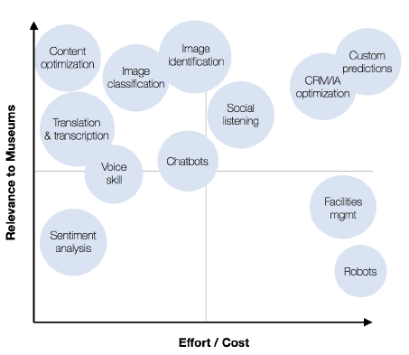
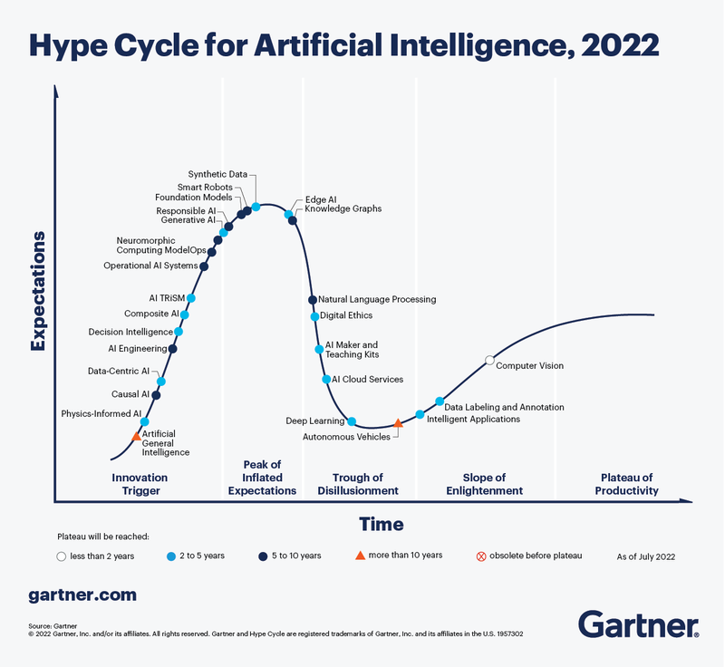
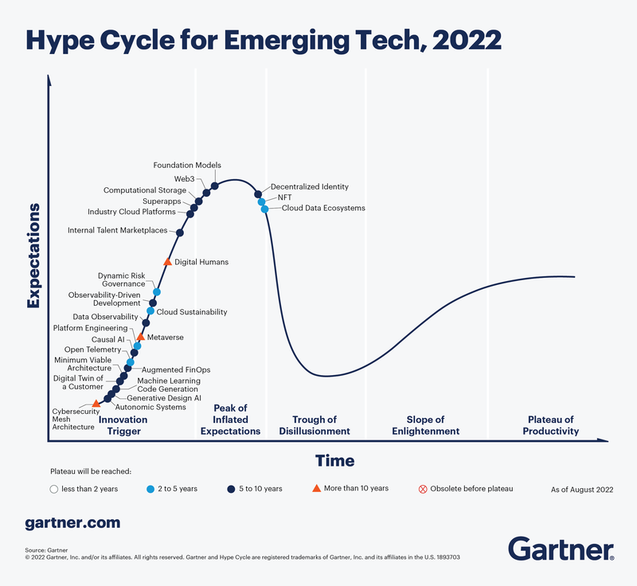
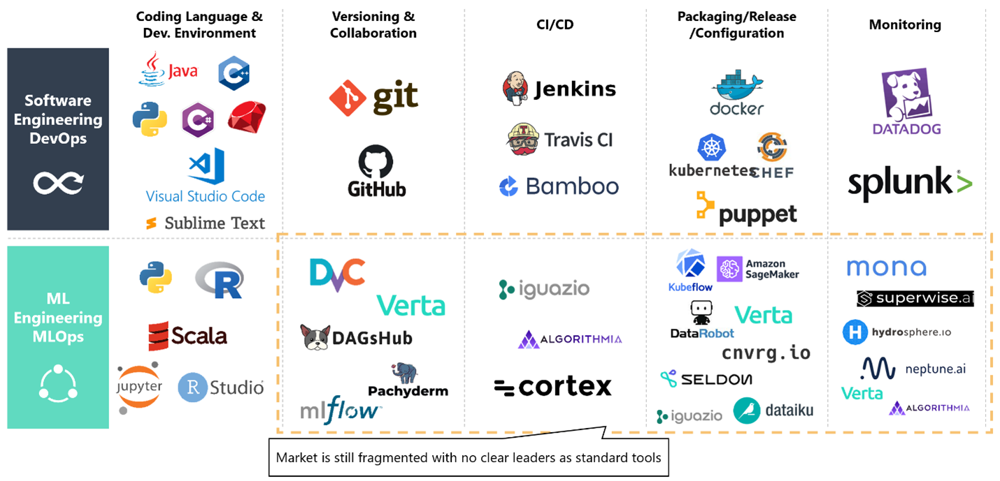

A.I.에 대한 우리의 가장 큰 두려움은, 자원이 부족한 분야에서 도입과 관련해서는 오히려 가장 큰 구원의 여지가 될 수 있다. 즉 A.I.는 인간 노동을 증강해 더 적은 것으로 더 많은 일을 가능하게 하는 독특한 위치에 있고, 박물관 직원의 시간을 더 흥미로운 문제에 쓰도록 해방할 수 있다. MLOps는 딥러닝 커뮤니티 안에서도 최첨단이고 박물관에서는 말 그대로 거의 들어본 적 없는 것이지만, 나는 박물관 업무 환경에 고유한 특징 때문에 이것이 도입을 위한 가장 보람 있는 기술 스택이라고 주장하려 한다. 또한 오픈소스 커뮤니티와 교류함으로써 내부 기술 역량 부족을 해결하면서, 박물관이 사회에서 갖는 독특한 역할, 즉 우리가 사용하는 도구에 대한 대화와 비판적 참여의 공간이라는 역할을 부각할 수 있다. 따라서 이 글은 비기술 독자를 위해 아래 영역을 논의한다:

1.  박물관 기술 생태계의 핵심 과제
    
2.  기회 - 왜 박물관을 위한 MLOps인가
    
3.  사례 연구
    
4.  MLOps가 어떤 모습인지
    
5.  xOps(DevOps, DataOps와 MLOps) 개요
    
6.  아키텍처 원칙, 도구와 모범 사례
    
7.  권고
    

나는 소장품 관리와 관련 사용 사례의 렌즈로 이를 보겠지만, 여기서 논의하는 원칙과 과정의 전반적인 방향은 기관의 기술 생태계 내 다른 시스템에도 적용될 수 있다.

# 박물관 기술 생태계의 핵심 과제

박물관 기술 전문가가 자주 언급하는 과제는 박물관 기술 프로젝트에 필요한 시간과 노력에 대한 오해와 관련이 있다 \[1\]. 박물관 부문의 디지털 역량 격차가 특히 심각할 수 있다는 점을 생각하면 놀랍지 않다. 잉글랜드 예술위원회의 기관 중 37%가 “역량과 지식 부족이 디지털 목표 달성의 주요 장벽”이라고 답했다 \[2\]. 프로젝트가 제대로 범위 설정되지 않거나 기술적 숙련도 부족으로 추정이 나쁘면 결국 모두가 좌절한다. 이것은 박물관 부문뿐 아니라 IT 내부에서도 어려운 문제다. 기술 지형이 너무나 방대하고 빠르게 진화하기 때문이다. 블록체인, 네이티브 앱 개발, 웹 개발, 클라우드 기술, 서버리스, 혼합현실, 데이터 과학, 머신러닝, 알고리즘 등은 모두 IT와 디지털이라는 상위 범주에 속하지만 서로 매우 다르고 고도로 전문화된 기술 집합이다.

조달 절차가 폭포수식 개발을 강제하고 내부 개발자가 없는 기관은 대개 서로 대화하지 않는 단절된 이질적 시스템의 집합으로 끝난다. 이는 물려받은 레거시 때문이거나 공급업체가 상호운용성을 자신의 업무 방식에 포함할 동기가 없기 때문이다. 그 결과 하류에서 여러 혼란이 생긴다. 중복된 절차가 많고(어딘가에서 업데이트된 것이 다른 곳으로 자동 동기화되지 않음), 서로 다른 사람들이 다른 문서 출처를 참조하여 혼란이 발생한다.

마치 자기 금상자의 열쇠를 갖고 있지 않아서, 무언가를 찾으러 갈 때마다 자기 자산에 들어가기 위해 비용을 내야 하는 것과 같다. 더 나쁘게는 그것이 정확히 어디 있는지도 모를 수 있다. 명확한 문서가 있어도, 공급업체 A, B, C가 서로 다른 시스템을 구축하고 지원한다면 서로 협력할 동기가 없다. 함께 일해야 할 때 오히려 서로에게 책임을 미룰 수도 있다. 이것은 박물관이 기술 회사가 되어야 한다는 말이 아니다. 오히려 내재적 제약을 이해하고 이상적인 최종 상태를 그려, 이를 염두에 둔 최적 경로를 설계하는 것이 중요하다.

# MLOps란 무엇인가?

MLOps는 “실험실” 조건에서 모델을 만드는 과학적 연구의 반대편, 즉 엔지니어링 측면과 같다. 컴퓨터 비전 개념 증명 \[3\]을 프로덕션으로 전환하는 데 빠진 요소다.

> “All of AI, .., has a proof-of-concept-to-production gap. The full cycle of a machine learning project is not just modelling. It is finding the right data, deploying it, monitoring it, feeding data back \[into the model\], showing safety—doing all the things that need to be done \[for a model\] to be deployed. \[That goes\] beyond doing well on the test set, which fortunately or unfortunately is what we in machine learning are great at.” — Andrew Ng

# 기회 - 왜 박물관을 위한 MLOps인가

무엇보다 박물관에서 MLOps를 해야 하는 주된 이유는 Figure 1 \[4\] 아래에 보이는 것처럼 가능한 가장 큰 투자수익률을 제공할 수 있는 A.I. 기술을 운영화하기 위해서다.

**Figure 1**. Popular AI subcategories, mapped to axes of museum relevancy and effort/cost.

블록체인과 메타버스처럼 많이 과장된 기술은 설계 공간이 가능한 사용 사례의 범위보다 훨씬 넓어 시간 지평상 훨씬 더 멀리 있다. 반면 A.I.는 이미 MATANA2 기업군 전반에 대규모로 배포되었고 주류로 갈 준비가 되어 있다. 아래 Figure 2에서 박물관 부문에 특히 관련 있는 A.I. 혁신의 상당수가 Figure 3의 NFT와 Web3 같은 다른 신흥 기술과 달리 이제 “Slope of Enlightenment” 단계에 있다는 점을 보라.

**그림 2**. … “2년에서 5년 안에 주류로 채택될 것으로 예상되는 혁신…… 이러한 혁신을 일찍 채택하면 상당한 경쟁 우위와 비즈니스 가치를 만들고 AI 모델의 취약성과 관련된 문제를 완화할 수 있다.”

**그림 3**. 2022년의 신흥 기술은 세 가지 주요 주제로 나뉜다. 진화하고 확장되는 몰입형 경험, 가속화된 인공지능 자동화, 최적화된 기술 전달 방식이다.

도입 장벽과 PoC에서 축적된 과거의 학습은 우리를 지금 이 순간으로 데려왔다. 과거에는 전체 연구팀이 필요했던 일을 이제는 작은 그룹이 할 수 있게 되었고, 박물관은 MLOps를 통해 이러한 혁신을 활용하기에 특히 좋은 위치에 있다. 그 이유는 데이터와 애플리케이션에 고유한 특성, 즉 콜드스타트 문제, 담론의 필요성, 그리고 마지막으로 내부 인력과 기술 역량의 부족 때문이다.

콜드스타트 문제는 박물관의 경우 특히 심각하다. 많은 데이터가 아예 존재하지 않는 환경, 즉 기존 훈련 데이터와 잘 작동하는 파이프라인이 풍부하지 않은 환경에서는, 데이터셋 구축과 라벨링에서 배포까지 이어지는 파이프라인을 운영화하고 시스템으로 다시 피드백되는 실제 데이터를 확보하는 MLOps의 역할이 특히 중요하다. 따라서 이 과정을 가능한 한 엔드투엔드로 자동화하면 더 적은 자원으로 더 많은 일을 할 수 있다.

# MLOps는 어떤 모습인가

이론상, 몇 명의 사람과 게임용 PC 몇 대면 작품 자동 주석을 위한 A.I. 모델을 만들 수 있다. 그런 모델을 MLOps를 통해 프로덕션에서 운영화하면, 박물관 컬렉션을 훨씬 더 접근 가능하고 발견하기 쉽게 만드는 견고한 시스템을 구축하는 데 필요한 추가 미세 조정 데이터를 얻을 수 있다.

아래에서는 색상을 자동으로 추출하고 조회를 위해 데이터베이스에 추가하는 데모를 볼 수 있다.

<iframe alt="Art API Update: Extract Colours &amp; Add to Collection 19.11.2022" src="https://www.youtube.com/embed/QN8Jn0KidMU?feature=oembed" aria-describedby="nogcdodrxpi-figure-caption" allowfullscreen="true" style="width: 100%; aspect-ratio: 16 / 9; height: auto; border: 0; "></iframe>

Art API Update: Extract Colours & Add to Collection 19.11.2022

# **Architectural Principles, Toolings and Best Practices**

-   Cloud-based
    
-   Open APIs
    
-   Federated access  
      
    
    
    
    **Figure 4**. Overview of DevOps and MLOps 도구.

---

*Originally published on PubPub at [erniesg.pubpub.org/pub/gcdzise9](https://erniesg.pubpub.org/pub/gcdzise9).*
