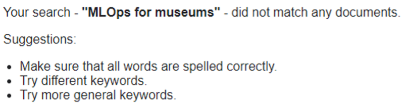
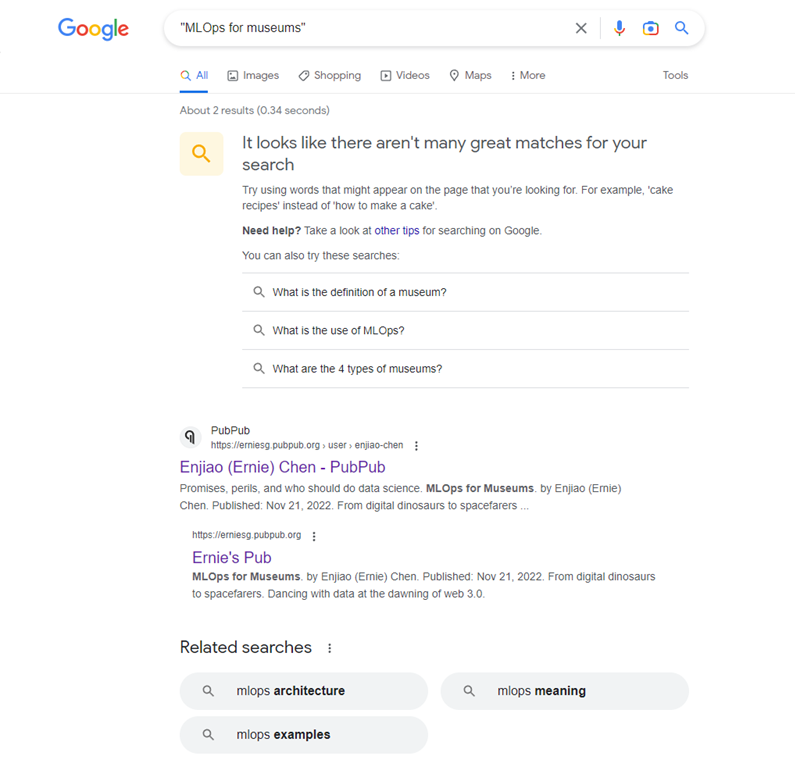
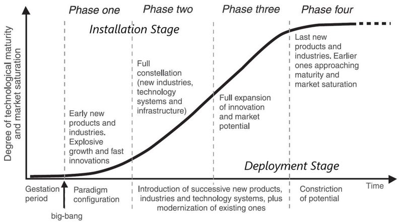

我的意思是：“杀猪焉用牛刀”，也就是不需要用大锤来敲开一颗坚果。大型语言模型那种难以承受的轻盈之处在于，它们并不是为某一个特定问题优化的。虽然像 GPT-4 这样的多模态模型，以及我做原型的搜索引擎里用到的东西都很令人兴奋，但我正屏息观察工程师、科学家和研究人员会怎样把一个类似人脑的东西一路编码到极致。

4 个月前，我和 2 个队友使用监督学习和无监督学习方法来做艺术品的自动标注。结束之后，我开始对构建 MLOps 流程感兴趣，想从概念验证走向生产环境；而如果当时你搜索 “MLOps for museums”，整个互联网都是零结果。

现在，Google 会把你指到这里，而我写这篇文章只是为了加强这个关键词密度和关联，嘿嘿。

对我来说有趣的是，当我放弃 supervised learning 和 unsupervised learning methods，改为基于 OpenAI 的 Contrastive Language-Image Pre-Training 和 Jina 的 neural 搜索 能力 来构建时，用不到半天的工作就让一个月的（part-time）团队努力变得 obsolete。更有趣的是，人们对 搜索 和 automated annotation 的接受方式差别很大。不知怎么的，我们对前者宽容得多，会照单全收结果；而在后者，人们似乎会被 machine-made representations 这个想法困扰，这让我困惑。也许我们把更大的 accountability 和 trust 赋予 human-generated 知识（无论 human memory 多么 fallible，视角多么有限），因为那里有另一个像我们一样的存在，嵌入在特定的 cultures 和 上下文 中，可以被追责；同时我们却方便地忽略了，这些人类本来也可能不同程度地使用技术。所以真正的谜题是：到底是什么阻止我们接受这样一种世界表征 - 它由某个特定模型 informed，以某种特定方式 constructed，并由一个具体的 human 智能体 建造？也许我们只是不喜欢这面镜子照回给我们的东西：我们最深处的 biases 和 prejudice。我们宁愿看向别处。我们宁愿继续在沙上建 castle，而不愿冒险去寻找新大陆。

有趣的是，大多数人似乎更喜欢 deterministic 结果 的返回，而不是在 iterations 中进行的 stochastic optimisations。我不知道这个看似孤立的 observation 是否能很好地回扣到我们人类心理的某些部分，或者也许只是我在 overfitting。

总之，搜索很有意思，因为它是一个成熟、巨大的市场机会，而我做一些搜索时，刚好碰到了 Google 效能的限制。还有普通话互联网和普通话搜索，我该从哪里说起...？当部分互联网人口生活在 21 世纪的 Cultural Revolution 中时，当前搜索形式和 GPT-x 的真正限制，是容易受到审查影响，以及垃圾信息的洪流。归因和更好的事实核查机制不会自动让更多人对真相更感兴趣，也不会自动让人们在多重宇宙之间寻找共同点；但我仍然认为，把这种机制做出来很重要，把它们作为抵御虚假信息和幻觉上涨潮水的堤坝。在我们正身处的这个世界里，**创作** 的成本接近于零（或者每 1000 个 ChatGPT tokens $0.002，如果通过 API 访问还 [便宜 10 倍](https://the-decoder.com/openai-api-for-chatgpt-pricing/)，那你还有什么理由不学编程!? :p），我很期待看到这些技术力量如何重塑创造力，并开启新的范式、新的商业模式，以及此前不可能的新表达和组织形式。Keynesian possibilities for our grandchildren 会在这样的世界里重新变得相关吗？还是这个 Infinity Gauntlet 会让世界的一半人至少陷入虚无主义，最坏则走向反抗，因为工作（以及它附带的意义，尽管这种联系并不稳固）蒸发到空气中？

就像人生中大多数事情一样，我们现在看到的模型的泛化能力和特异性之间大概存在取舍。尘埃落定之后，要找到正确的平衡，需要大量实验。

Source: The life cycle of a technological revolution from “Technological Revolutions and Financial Capital” by Carlota Perez.

所以目前，我会继续 build。😊

---

*最初发表于 PubPub：[erniesg.pubpub.org/pub/ettc9fqh](https://erniesg.pubpub.org/pub/ettc9fqh)。*
