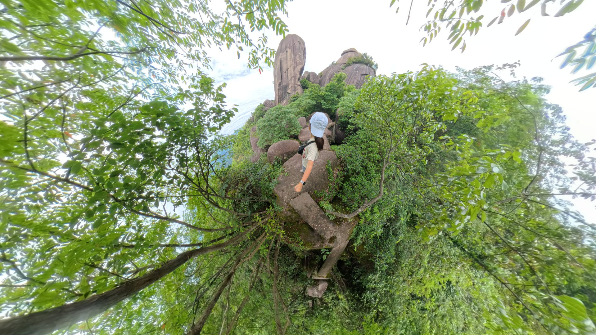
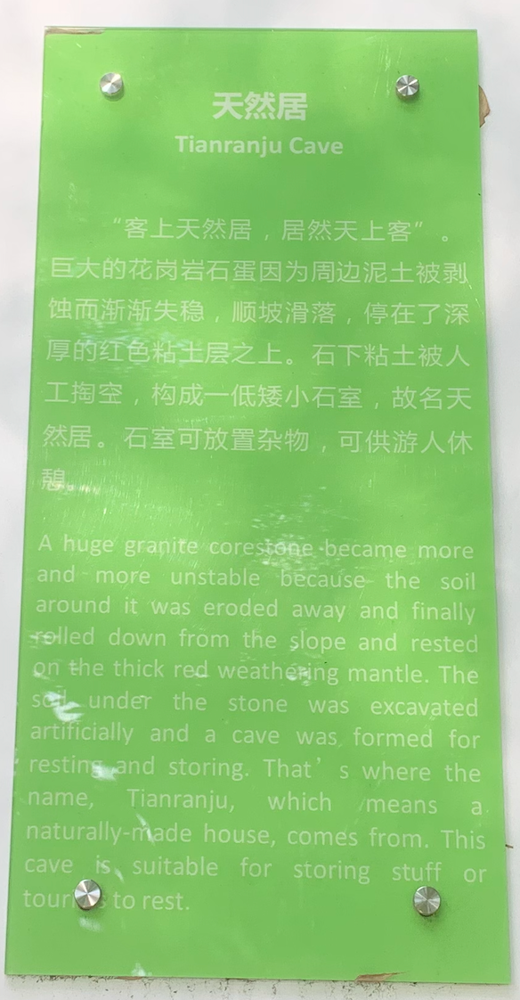
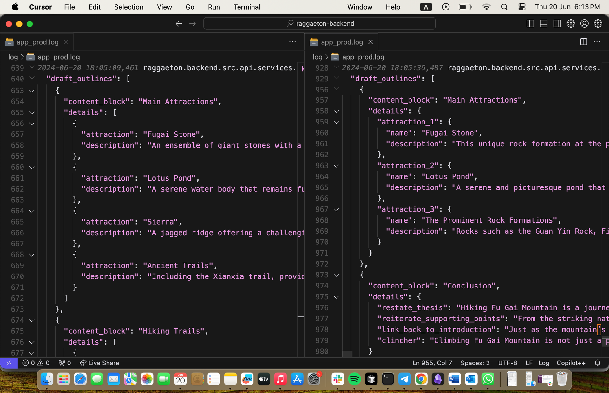

2024年6月3日に覆蓋山（浮蓋山）を歩いた記録をもとに、通常版と RAGgaeton を使った版の Claude 3.5 と GPT-4o に同じメモを渡し、文章作成能力を比較してみた。



RAGgaeton パッケージは、人間とコンピュータの協働の実験として作ったものだ。人間の創造性と A.I.（人工知能）の強みを活用して、独自コンテンツの制作を拡張するための試みである。この投稿では、RAGgaeton の着想、主な機能と利点、実例デモ、技術的課題と学び、そして A.I. で強化されたコンテンツ制作の未来の可能性を見ていく。

## RAGgaeton の火花

率直に言おう。世界は A.I. を訓練するデータを使い果たしつつある。そこで私は考えた。A.I. を使って、人間による独自コンテンツの生成を強化できるとしたらどうだろう？訓練データがますます希少になる一方で、コンテンツは量的にも質的にもまだ不足している。確かにこの領域では、A.I. がかなり良い仕事をできる余地がある。

私にとって、*独自の* 文章を書くときには、システム1の思考とシステム2の思考の間にいつも大きな隔たりがあった。頭の中には下書きのアウトラインがあり、自分が作りたい論旨の大まかな感覚もある。しかし、情報を集めて整理し、座って完全な文と段落に落とし込む作業は？いつまでも終わらない。自由に使える調査助手の一団があればいいのに...

そこへ **検索拡張生成** (RAG) に支えられた **大規模言語モデル** (LLMs) が救いに来る。

RAGgaeton は LLMs と RAG の力を使ってこの隔たりを埋め、選んだ信頼できる根拠に基づいた独自コンテンツを大規模に作れるようにする。

## デモ：実際に動く RAGgaeton

RAGgaeton は、自分のデータからあらゆる種類のコンテンツを自動生成するために私が作ったパッケージだ。私自身、そしてきっと多くの人が文章作成で直面するいくつかの問題を解くように設計している。

1\. 大規模言語モデルの文章が陳腐に聞こえすぎる

2\. さまざまな情報源から情報を集め、検索する必要がある

3\. 一貫した流れと整合性を維持する必要がある

4\. 編集し、反復改善できる、拡張可能で再現性のある創造的な出力がほしい

RAGgaeton ができることの簡単なデモは次の通り。

<iframe alt="Try Things #:2 Claude 3.5 vs. GPT-4o for Automated Travel Writing with RAGgaeton" src="https://www.youtube.com/embed/DjiAUkD7tfM?feature=oembed" aria-describedby="nq0tj29bz5n-figure-caption" allowfullscreen="true" style="width: 100%; aspect-ratio: 16 / 9; height: auto; border: 0; "></iframe>

Try Things #:2 Claude 3.5 vs. GPT-4o for Automated Travel Writing with RAGgaeton

-   私の実装は [RAGgaeton Git repository](https://github.com/erniesg/raggaeton) で確認できる
    

私のお気に入りの 生成された見出し は `“From Sea to Sky: Unraveling the Mysteries of Fu Gai Mountain's 'Floating Cap'“` で、`edit-content` 後の 最終出力 は以下の通りだ。

> **Introduction**
> 
> **Hook**: What if I told you that the mountain you're about to climb was once submerged beneath an ancient sea, leaving behind a legacy of otherworldly rock formations?
> 
> **Thesis**: Fu Gai Mountain's geological history and unique landscape offer hikers an opportunity to explore a captivating blend of natural history and breathtaking scenery in Zhejiang province.
> 
> Beneath your feet lies a mountain with a secret: it was once submerged under an ancient sea. \[TextFX: POV\] As you lace up your hiking boots at the base of Fu Gai Mountain in Zhejiang province, you're not just preparing for a climb – you're about to embark on a journey through time itself. This geological wonder, with its otherworldly rock formations, stands as a silent sentinel, guarding the mysteries of our planet's past. \[TextFX: SIMILE\] Like a book written in stone, each step up the mountain's slopes reveals a new chapter in Earth's epic saga, waiting for intrepid explorers to decipher its cryptic pages.
> 
> Fu Gai Mountain's geological tapestry weaves together millions of years of Earth's history with breathtaking vistas. \[TextFX: ALLITERATION\] From fantastic formations to peculiar peaks, the mountain's unique features captivate climbers, geologists, and casual tourists alike. As you ascend, you'll encounter the mountain's famous 'floating cap', a gravity-defying display of nature's artistry. \[TextFX: SCENE\] The air grows thin and crisp, carrying whispers of ancient tales and the faint scent of pine. This isn't just a hike; it's a pilgrimage through time, offering a rare glimpse into both the Earth's tumultuous past and China's rich cultural heritage.
> 
> **Setting the Scene**
> 
> Straddling the border of Zhejiang and Fujian provinces, Fu Gai Mountain rises like a sleeping giant from the surrounding landscape. \[TextFX: CHAIN\] Its imposing silhouette - peak, ridge, slope, valley, forest, trail, hiker, adventure - beckons to those seeking communion with nature's grandeur. \[TextFX: UNEXPECT\] Once a formidable barrier to southward expansion during the Tang dynasty, this geological marvel now serves as a bridge between epochs, inviting modern-day explorers to scale its heights and unravel its secrets. The mountain's strategic location offers not just a physical challenge, but a journey through the annals of Chinese history and natural evolution.
> 
> この山の「四絶」は、まるでファンタジー小説から抜け出したような異世界的な雰囲気を生み出す。\[TextFX: ACRONYM\] CAPE - Clouds, Abysses, Peaks, and Enigmatic springs - は覆蓋山の独特な特徴を言い表している。\[TextFX: FUSE\] 山頂では巨大な岩が危うい均衡で重なり、有名な「浮蓋」または「紗帽」の景観を形づくる。それは人を戸惑わせると同時に楽しませる地質学的な幻のような光景だ。奇妙な雲は険しい峰の周りを舞い、幽玄な形を絶えず変えていく。神秘的な洞窟は山の過去をささやくようで、変わった泉は季節に関係なく一定の温度を保つ。\[TextFX: EXPLODE\] これらの要素が合わさり、まさに “out of this whirl” な風景、現実に対する私たちの感覚を揺さぶる、目がくらむほど美しい自然の奇観を作り出している。

私は Sonnet の文章の方が好みだ。指示通り [TextFX](https://developers.googleblog.com/en/how-its-made-textfx-is-a-suite-of-ai-tools-made-in-collaboration-with-lupe-fiasco/) を適用している点も好きだが、最終記事は少し未完成に見える。これは指定した 600語の `desired_length` と関係しているのかもしれない。長さに応じてプロンプト設計を改善するか、処理の連鎖をさらに最適化した方がよさそうだ。参考までに、これが生成された [コンテンツブロックとトピックセンテンスを含む完全な下書き](https://cloud.langfuse.com/project/clxm2w3vt000r12wji2eyymvd/traces/80fd9327-6f17-48e9-a56e-019c5daa4c5b?observation=9194ce51-c4c2-4279-a3f9-7ac9c8516a30) だ。

Claude 3.5 Sonnet と GPT-4o それぞれの標準出力と記事の変形を比較したい場合は、下へスクロールしてほしい。

## RAGgaeton がすること

書く時間が足りない？問題ない。RAGgaeton はコンテンツ生成をエンドツーエンドで自動化できる。

1\. 調査質問を考えてくれる（もちろんトピックの種は必要）

2\. 調査を行う

3\. 見出しを生成する

4\. 完全な記事を下書きする

5\. TextFX を適用する（頭韻 で 書き換え、ideas を 展開 など）

最初のアイデアを与え、RAGgaeton に作業を任せ、その後生成された下書きを編集・修正する形で使える。今後の反復では編集しやすいインターフェースを実装し、一度書けばどこでも公開できるようにしたい。

## Key Features and Benefits

私はこれを、異なるコンテンツ種別とコンテンツ上の操作を連鎖させるさまざまな方法に対して拡張できるよう作った。同時に最先端の ColBERT 検索器モデルを活用している（研究者の言葉であって、私の言葉ではない）。これにより、生成に最も関連する断片を取得できる。

### Scalable Content Generation

ユーザー は 再利用可能 コンテンツ blocks を一度定義し、それらを 組み合わせ して望む article 種類 を作れる。仕組みは次の通り。

1.  まず `content_blocks.json` で 再利用可能 コンテンツ block を定義する
    

```json
  "Setting the Scene": {
    "description": "Introduce the setting with vivid descriptions to immerse the reader.",
    "details": {
      "optional": [
        "Time of Day",
        "Weather Conditions"
      ],
      "required": [
        "Location Description",
        "Atmosphere"
      ]
    }
  }
```

2.  次に、このような プロンプト を コピー して 編集 し、これらの コンテンツ blocks を `article_{article_type).yaml` の 可能な構造 に 組み合わせる する
    

```yaml
generate_draft_travel:
  system_prompt: |
    You are an expert travel writer skilled in creating compelling and engaging content for online publications. Always respond with a structured, valid JSON, adhering strictly to the provided example format. Do not include any other text or explanations outside of the JSON structure.
  message_prompt: |
    Task: Given the following context, generate an updated structure for a Travel Article to be published.

    Context:
    - Headline: {headline}
    - Hook: {hook}
    - Thesis: {thesis}
    - Article Types: {article_type}
    - Topics: {topics}
    - Context: {context}
    - Data: {optional_params[data]}
    - Publication: {optional_params[publication]}
    - Country: {optional_params[country]}
    - Personas: {optional_params[personas]}
    - Desired Length: {optional_params[desired_length]} words
    - Scratchpad: {optional_params[scratchpad]}

    You may use the possible structures below as a starting point. Each structure is composed of content blocks. Rewrite, reorder, substitute, remove, add new or simply flesh out further details for the structure and content blocks so as to be coherent with your headline, hook and thesis.

    Please provide the response in the following structured JSON format:

    {{
      "draft_outlines": [
        {{
          "content_block": "Introduction",
          "details": "[Content Block Details]"
        }},
        {{
          "content_block": "Personal Circumstances",
          "details": "[Content Block Details]"
        }},
        {{
          "content_block": "Destination Overview",
```

3.  関連する パラメータ と `article_type` の value を指定して `generate_draft` エンドポイント を呼べば、生成 が始まる。
    

P.S. コンテンツ blocks を書き出す代わりに アルゴリズムで並べ替える して structures を作ることもできる。将来の work かもしれない。

### A.I.-Powered Re検索 and Retrieval

RAGgaeton はただ書くだけではない。調査 もする。異なる プラットフォーム での further 調査 のために キーワード を生成し、検索 を実行し、その 情報 を データベース に 保存 する。文書レベルの埋め込み ではなく トークンベースの後期相互作用機構 を活用することで、RAGgaeton は コンテンツ に最も 関連する な 情報 を見つけ、正確性 と 深さ を確保できる。現在の実装は `you.com` と `Obsidian vaults` をサポートしており、今後さらに 情報源 を追加する予定だ。

### Creative Enhancement のための TextFX

普通の 文章 を TextFX で 引き込む コンテンツ に変える。頭韻 を加え、複雑な考え を 展開 し、word を似た響きの 句 に explode するなど、すべて simple な `edit-content` コマンド でできる。

## The 技術スタック

技術に興味がある人向けに、RAGgaeton は以下で作られている。

1.  自然言語生成 のための Claude 3.5 Sonnet と GPT-4o
    
2.  データベース 管理 のための Supabase
    
3.  トレースと監視のための Langfuse
    
4.  効率的な情報検索のための Llama Index（そしてその後、文書とデータとの状態を持つチャット）
    
5.  データ 検証 のための Pydantic
    
6.  `generate-research-questions`, `do-research`, `generate-headlines`, `generate-draft`, `generate-topic-sentences`, `generate-full-content`, `edit-content` を公開する原子的な API エンドポイントのための FastAPI
    

この組み合わせにより、RAGgaeton は一貫性と流れを保ちながら、高品質で文脈に合ったコンテンツを届けられる。

## RAGgaeton in Action のレビュー: 入力と出力

RAGgaeton の力を本当に理解するために、異なるモデルの出力を実際に比較してみよう。出発点として [you.com](you.com) と覆蓋山についての下書きアウトラインを使う。旅の後に旅行作家が書き留めそうな粗いメモのようなものだ。

### Input: 書き手の下書きメモ

RAGgaeton の データベース に 取り込む 情報 の例は次の通り。

```html
An A.I. Engineer Goes Gradient Descent on Floating Cap Mountain

<Intro>
Just wanted to climb a mountain somewhere after seeing Yu Yan's concert in Suzhou and it has this 仙霞古道 (got part of my mum's name in it) which seemed interesting, the mountains 江郎山 and 浮盖山 seemed fun too

<Getting There>
Jiang Shan train station was under renovation, so I took public buses and another super long ride that locals told me to get on; should have went another route instead. I think that sometimes locals also don't always have the best source of info, or even if they do, what suits them might not suit me?

<Destination Vibes>
I stayed in the accommodation for many days to work on a coding assignment and finally found the time on 3 June to go hiking
Lived near Nian Ba Du Ancient Town and the whole area had strong calligraphy vibes, like many families hung these couplets down their front doors, owner of the place I stayed in would practice calligraphy every now and then

<Transportation>
I called a car by Didi, who only took me there because if he declined it would affect his ratings
It was a winding path up and we weren't able to agree on him fetching me on the way down, so I decided to figure that out later

<About the Mountain>
Fu Gai Shan, or floating cap mountain, 
主峰峰顶盘石垒叠，下者如盘，上者如盖，故名浮盖山

"云怪，石怪，洞怪，泉怪"是浮盖山的四大特征。徐霞客曾赞曰： "怪石拿云，飞霞削翠"。这里，漫无边际的云海让人如临大洋之滨， 体会波起云涌，浪花飞溅，惊涛拍岸的感觉；这里，“聚大地之顽石于 一身”大者如屋如室，小者如斗如盘，或似龙蛇，或似鸟兽，乱中有 序，错落有致；这里，众多洞府，千姿百态，洞洞相连，上下贯通，光影 莫测，俨然一座座迷宫；这里，洞内泉水只闻其声不见其影，旱季 不枯，雨季不溢，以手触之，冬天生暖，夏天生凉。

浮盖石  
Fugai Stone

浮盖石由数块大小不一的巨石叠叠而成， 峰顶覆一奇石，形如一顶鸟纱帽，又称纱帽 石。以前许多学子都在此聚会，衣锦还乡后， 更会登上纱帽石祈望自己以后的官运一帆风 顺。著名作家高洪波曾为此题词：“头上三 千烦恼丝，桂冠一顶是浮盖。”

Fugai Stone is made of several huge stones of different sizes. The peak is covered with a strange stone, which looks like a gauze hat. Therefore, it’s also called Wusha Stone. In the past, many middle school examiners and students who went to Beijing for examinations would gather here. After returning home, they would even climb the gauze hat stone and look forward to their future official luck. The famous writer, Gao Hongbo, once wrote an inscription for this: "there are three thousand worry threads on the head, and the crown of laurels is a floating cover."

Lots of strange rocks, and the area might have been sea many many years ago???

齿状山脊  
Sierra

沿着浮盖山的主脊往回望，但见每隔几 米就有突岩兀立。大序次第，掩映于翠绿的阔 叶林之上。望云者石、观音石、拳头石，一字 排开，虽形态各异，但海拔相近。约九百余 米，组成了一段长长约270米、面积约1.2万平 方米的齿状山脊。这里的地质条件复杂且大尺度稳定， 在很长的时间内风化主导的漫长地质过程，形成植被茂 密的准平原地表。后来，地壳再度活跃，整体抬升， 并渐渐被流水侵蚀，残留形成山脊。
```

私は、撮った写真から A.I. で text を extract することで 下書き outline 用の 情報 を得た。下のようなものだ。



### Task

標準 LLM クライアントs には、次の プロンプト に基づいて Fu Gai Mountain への hike について travel 文章作成 を生成するよう依頼した。

```text
write me a 600 word travel article about hiking to fu gai mountain in zhejiang
Scratchpad: I saw an ant try to move a flower on the hike, it was doing so with all its might. When not doing gradient descent, an A.I. engineer had lots of fun climbing a physical mountain. I took a challenging route and ended up climbing over rocks and caves.
```

RAGgaeton モデルだけが上の下書き入力メモにアクセスできた。したがって下の出力は、2つの軸に沿ったバリエーションの結果である。限定的な文脈 vs. 豊かな文脈（書き手の下書きメモ付き）、zero-shot LLM 生成 vs. multi-step LLM 生成。

### Vanilla GPT-4o Output

```text
Hiking to Fu Gai Mountain: A Journey through Nature's Majesty
Nestled in the heart of Zhejiang province, Fu Gai Mountain stands as a testament to nature's unspoiled beauty and the adventurous spirit of those who seek to conquer its heights. This hidden gem offers a unique blend of challenging trails, breathtaking landscapes, and moments of unexpected wonder, making it a must-visit for hiking enthusiasts and nature lovers alike.

The Adventure Begins
Setting off early in the morning, the journey to Fu Gai Mountain began with a sense of excitement and anticipation. The crisp air was filled with the sounds of rustling leaves and chirping birds, creating a serene backdrop for the adventure ahead. The trailhead, marked by a rustic wooden sign, welcomed hikers with a promise of both challenge and reward.

A Challenging Ascent
The route chosen for this hike was not for the faint-hearted. As an A.I. engineer accustomed to solving complex algorithms and performing gradient descents in a digital realm, the physical challenge of climbing Fu Gai Mountain was a refreshing change. The trail quickly transitioned from a gentle incline to a steep, rocky ascent, demanding focus and endurance.

Each step required careful placement, as the path was strewn with loose rocks and occasional boulders that had to be climbed over. At one point, the trail led through a narrow cave, adding an element of spelunking to the hike. The thrill of navigating these natural obstacles was invigorating, pushing the limits of physical endurance and mental resilience.

Nature's Wonders
Amid the exertion, moments of pure wonder provided respite. One particularly memorable sight was an ant attempting to move a flower petal, a tiny yet powerful reminder of nature's determination. Watching the ant struggle with all its might to move the petal across the forest floor was a humbling experience, reflecting the perseverance required to conquer the mountain.

Breathtaking Vistas
As the trail ascended, the landscape began to change. Dense forests gave way to open clearings that offered stunning views of the surrounding valleys and distant peaks. Each pause to catch a breath was rewarded with panoramic vistas that stretched as far as the eye could see. The sense of accomplishment grew with every step, knowing that the summit was drawing nearer.

Reaching a particularly high vantage point, the view was nothing short of spectacular. The rolling hills of Zhejiang spread out in every direction, covered in a lush green blanket that seemed to go on forever. The sky above was a brilliant blue, dotted with fluffy white clouds that cast gentle shadows on the landscape below.

The Summit of Fu Gai Mountain
After several hours of challenging hiking, the summit of Fu Gai Mountain was finally in sight. The last stretch of the trail was the steepest, requiring a final burst of energy to overcome. But the effort was well worth it. Standing at the peak, a sense of triumph washed over me. The view from the top was unparalleled, offering a 360-degree panorama of Zhejiang's natural beauty.

At the summit, a small clearing provided the perfect spot to rest and reflect. The journey had been arduous, but it was also deeply rewarding. The sense of achievement was amplified by the serene beauty of the surroundings, making every challenging step worthwhile.

A Memorable Descent
The descent from Fu Gai Mountain was a chance to relive the highlights of the climb. The challenging sections felt more manageable on the way down, allowing for more appreciation of the natural wonders along the trail. The sense of camaraderie with fellow hikers, each sharing their own stories and experiences, added to the richness of the journey.

Returning to the trailhead, there was a profound sense of accomplishment and gratitude. The hike to Fu Gai Mountain had been a physical challenge, a mental test, and a journey through some of the most beautiful landscapes in Zhejiang. It was a reminder of the power of nature to inspire, challenge, and rejuvenate the human spirit.

Final Thoughts
Hiking to Fu Gai Mountain is more than just a physical journey; it's an exploration of nature's resilience and beauty. Whether you're an experienced hiker or a nature enthusiast, the trail offers a unique blend of challenge and reward that leaves a lasting impression. For anyone seeking an unforgettable adventure in Zhejiang, Fu Gai Mountain is a destination that promises both challenge and awe.
```

GPT-4o の text は極端に boring だ。あまりに general なので、Fu Gai Mountain を他のどの mountain に置き換えても成り立つ。

### Vanilla Claude 3.5 Sonnet Output

```text
Here's a 600-word travel article about hiking Fu Gai Mountain in Zhejiang, incorporating some elements from your scratchpad:
Scaling the Heights: A Journey to Fu Gai Mountain
Nestled in the lush landscape of Zhejiang province, Fu Gai Mountain stands as a testament to nature's grandeur and a beacon for adventurers seeking to challenge themselves amidst breathtaking scenery. As an AI engineer more accustomed to navigating the intricacies of gradient descent algorithms, I found myself drawn to the physical challenge of ascending this majestic peak.
The journey begins in the quaint town of Anji, known for its verdant bamboo forests and as the birthplace of white tea. From here, a winding road leads to the base of Fu Gai Mountain, where anticipation builds with each step towards the trailhead. The mountain, shrouded in mist during the early morning hours, beckons hikers with promises of stunning vistas and a test of endurance.
Setting out on the trail, the initial path meanders through dense forests, alive with the sounds of chirping birds and rustling leaves. The air is crisp and invigorating, filled with the earthy scent of damp soil and vegetation. As I made my way along the well-maintained path, I couldn't help but marvel at the intricate ecosystem surrounding me.
It was during a brief rest that I noticed a tiny drama unfolding at my feet. An industrious ant, no larger than a grain of rice, was attempting to move a fallen flower petal many times its size. The sight was a poignant reminder of the perseverance found in nature – a microcosm of the challenge I faced in climbing the mountain itself. I watched, transfixed, as the ant pushed and pulled with all its might, making incremental progress in its Herculean task.
As the trail steepened, the true test began. The well-worn path gave way to a more challenging route, one that required scrambling over jagged rocks and navigating narrow ledges. Each step demanded focus and determination. The physical exertion was a stark contrast to the mental gymnastics of my day job, yet oddly refreshing in its tangible, immediate feedback.
Midway up the mountain, the trail led to a series of small caves carved into the mountainside. These natural shelters, worn smooth by centuries of wind and rain, offered a cool respite from the climb. Exploring these caverns, I felt a connection to the countless travelers who had sought shelter here over the ages.
Emerging from the caves, the landscape transformed. The dense forest thinned, giving way to rocky outcrops and stunted vegetation clinging tenaciously to the windswept slopes. The air grew thinner, and each breath became more deliberate. Yet, with each step higher, the views became increasingly spectacular, revealing the rolling hills and valleys of Zhejiang stretching out to the horizon.
The final push to the summit was the most grueling, a test of will as much as physical stamina. Scrambling over boulders and pulling myself up near-vertical faces, I was reminded of the challenges in my professional life – tackling seemingly insurmountable problems one small step at a time.
Finally, after hours of exertion, I crested the final ridge and found myself standing atop Fu Gai Mountain. The 360-degree panorama was nothing short of breathtaking. Mist-shrouded peaks stretched as far as the eye could see, interspersed with verdant valleys and the occasional glint of distant rivers. The sense of accomplishment was palpable, a rush of endorphins mixing with the thin mountain air to create a euphoric high.
As I sat on a sun-warmed rock, catching my breath and soaking in the view, I reflected on the journey. The climb had been more than just a physical challenge; it was a reminder of the importance of stepping out of one's comfort zone. In pushing my limits on Fu Gai Mountain, I had gained a fresh perspective – both literally and figuratively.
The descent, while less physically demanding, offered its own rewards. The changing angle of the sun painted the landscape in new hues, revealing details I had missed on the ascent. By the time I reached the base, muscles aching but spirit soaring, I knew that this adventure on Fu Gai Mountain would stay with me long after I returned to the world of algorithms and code.
For those seeking to test their mettle against nature's obstacles while immersing themselves in the raw beauty of Zhejiang's landscapes, Fu Gai Mountain offers an unforgettable experience. It stands as a reminder that sometimes, the greatest achievements come not from conquering virtual challenges, but from scaling the very real peaks that surround us.
```

Sonnet 3.5 は language ではより良いが、Anji を hallucinated した。Fu Gai Mountain は Jiangshan にある。

全体として、richer 文脈 を持つ RAGgaeton の 出力 は、与えられた 下書き メモ に trip を grounding する点でより良い。

### RAGgaeton GPT4-o Outputs

-   [Scaling Fu Gai Mountain: A Hiker's Journey through History and Nature](https://cloud.langfuse.com/project/clxm2w3vt000r12wji2eyymvd/traces/0c1da248-be18-4668-ae1a-e8c741233b05?observation=9ff2a6ed-333a-469f-98cd-b21c2a039ab4)
    
-   [Fu Gai Mountain: The Hidden Jewel of Zhejiang's Sierra](https://cloud.langfuse.com/project/clxm2w3vt000r12wji2eyymvd/traces/fda89402-8647-4980-ad21-e2999e87df51?observation=f3b3dd22-a120-4ae0-afc9-37e51feddb34)
    
-   [Conquering the Enigmatic Fu Gai Mountain: A Hiker's Odyssey](https://cloud.langfuse.com/project/clxm2w3vt000r12wji2eyymvd/traces/eb9ee180-2618-4c2b-ac94-0d5a6e6406d1?observation=263efca4-640e-4cc6-81a8-98cf43f4aad7)
    

### RAGgaeton Claude 3.5 Outputs

-   [The Unexpected Thrills of Hiking Fu Gai Mountain: When the Path Less Traveled Leads to Adventure](https://cloud.langfuse.com/project/clxm2w3vt000r12wji2eyymvd/traces/48178662-c578-4abe-87d4-c443c802367d?observation=8c5fedc2-c63e-497a-b131-ba3bd69f1e98)
    
    -   climb の描写がかなり好きだ。実際こんな感じだったから :)
        
    
    > <iframe alt="China as a 360 Adventure: Come caving with me" src="https://www.youtube.com/embed/xUaq1HGO3lI?feature=oembed" aria-describedby="nlr1qcbeg2k-figure-caption" allowfullscreen="true" style="width: 100%; aspect-ratio: 16 / 9; height: auto; border: 0; "></iframe>
    > 
    > China as a 360 Adventure: Come caving with me
    > 
    > … Geological marvels and unorthodox pathways intertwine to create an adventure that transcends the typical trekking experience. Nicknamed '浮蓋山' for its summit's hat-like stone formation, Fu Gai Mountain stands as a testament to nature's artistry. Its trails meander through a tapestry of strange rocks, mysterious caves, and hidden springs, each turn revealing a new facet of the mountain's character. Like a game of 'I Spy' on steroids, hikers find themselves constantly scanning their surroundings, never knowing if the next step will lead them over, under, or through the mountain's enigmatic terrain. \[TextFX: UNEXPECT\]
    > 
    > Exploring this formidable peak pushes adventurers to their limits, both physically and mentally, while unveiling the raw splendor of China's diverse landscape. As hikers navigate its challenging terrain, they are not merely walking a path but solving a three-dimensional puzzle that Mother Nature herself has crafted. This journey of discovery demands agility, creativity, and perseverance, rewarding those who rise to the challenge with breathtaking vistas and a profound sense of accomplishment. Fu Gai Mountain stands as a natural playground where adventurers can test their mettle, transforming from mere hikers into intrepid explorers, each conquering their own personal Everest. \[TextFX: FUSE\]
    
-   [From Sea to Sky: Unraveling the Mysteries of Fu Gai Mountain's 'Floating Cap'](https://cloud.langfuse.com/project/clxm2w3vt000r12wji2eyymvd/traces/1134fd39-f32e-4636-89ac-c1ddd673833a?observation=6a3de36d-f7d6-481e-a07b-d8b5d95f35bb)
    
-   [Conquering Fu Gai Mountain: A Hiker's Adventure in Zhejiang's 'Floating Cap' Paradise](https://cloud.langfuse.com/project/clxm2w3vt000r12wji2eyymvd/traces/9169ac2d-6f9c-4d6d-adab-8ec84e422b99?observation=b18b2f3c-ebf0-4245-8bf6-ff5ce374eb99)
    

見ての通り、標準出力 はとても bland で general だが、RAGgaeton-generated コンテンツ は richer details、引き込む descriptions、cultural 文脈、そして input メモ と aligned した structured format を提供する。RAGgaeton が rough 下書きs を comprehensive で 引き込む な コンテンツ に変えられることを示している。

### Verdict

Sonnet 3.5 だけが in-文脈 learning で私が与えた TextFX を適用した。ただし desired length に合わせてさらに finetune する必要がある。全体として、検討した samples の中では text-wise に最も value が高い output だと感じた。

## My Design Philosophy

RAGgaeton を作るにあたり、私が念頭に置こうとしている key principles は三つある。

1\. \*\***Portable データ\*\***: Your コンテンツ should be yours, アクセスしやすい and usable across 異なる プラットフォーム and ツール.

2\. \*\***Tunable to your unique needs**\*\*: ユーザー should be able to enjoy granular control over モデル behaviour, 編集ing of 出力, operationalising the ワークフロー, 根拠づけられたness, etc.

3\. \*\***First-class support for Asian languages**\*\*: This is a personal passion of mine, given the current underrepresentation of languages like 中国語 on the web.

## Learnings and Challenges

RAGgaeton を作ることは insights と 課題 に満ちた journey だった。主な 学び は次の通り。

### Abstraction vs Specificity

この trade-off のバランスを取ることは constant challenge だ。私は、いつまでに何を achieve したいのかから逆算し、end goal を individual elements に de組み合わせる し、どの parts をより 再利用可能 にすべきかを見るのが有用だと分かった。

これにより `llm_handler.py`、`llm_processing.py`、`prompts.py` を分離した。`llm_handler.py` は `prompts.py` が formatted した プロンプト で call を行い、`llm_processing.py` は response を parse して エンドポイントs と相性よく動くようにする。こうすればすべての operation が atomic になり、どう chain するかを自由に決められる。

### Probabilistic Models を Deterministically Behave させる

直面した課題の一つは、言語モデルから予測可能な挙動を得ることだった。これに対処するため、Pydantic でリクエストとモデル出力に厳密なスキーマを定義した。こうした制約がないと何が起こるかの例がこれだ。



一方では `attraction` と `description` が `details` キーの中にネストされ、もう一方では `attraction_#` の中に `name` と `description` がさらにネストされている点に注目してほしい。これらのモデルは本当に “creative” だ。だから従来型プログラミングのパラダイムに対して予測可能で後方互換性のあるものにするには、作業を投資する必要がある。

### RAG の未来

私はプロンプトエンジニアリング、RAG、fine-tuning を A.I. Engineer の道具箱にある異なる道具だと考えている。文脈ウィンドウや他の要因がどう変わっても、RAG は残る。直感的には、文脈のノイズ対シグナル比が性能に重要なのは筋が通っている。モデルが世界最高水準の人間の専門家のように不要な情報を無視し、目の前のタスクに集中できる段階にはまだ来ていない。

## RAGgaeton の次

私は RAGgaeton を継続的に改善している。楽しみにしている next steps は次の通り。

1\. \*\***Evals and citations**\*\*: 失敗したときだけ alert してくれる automated evals と、どの コンテンツ 断片 がより shaky ground にあるかを highlight する citation system を実装したい。

2\. \*\***Refactoring and composability**\*\*: Pydantic schemas はまだ少し messy なので、整理して repetition を避けたい。

3\. \*\***中国語 生成**\*\*: これは特に楽しみにしている enhancement だ。A.I. がこんな言葉をもっと書けたら素敵ではないだろうか。

> “花香摇晃了一整个盛夏，空气漂浮蒸发着无数个恍惚的脸颊。择一张长椅坐下，看天边披上晚霞。”
> 
> —陈恩娇

かなり自由に訳すとこうなる。

> “The fragrance of flowers swayed through an entire summer, as fleeting faces evaporated into the air. Choose a bench to sit on, and watch as the evening glow comes on, mummed in memories of the day.”
> 
> —Ernie

## Generative A.I. で未来を（再）書く

私は人間と A.I. の協働が、コンテンツの量と質の両方を拡張する力を持つと信じているから RAGgaeton を作った。言語や情報の非対称性のような知識の壁をより多く取り除けるほど、より多くの人が恩恵を得られる。

中国語話者は世界人口の 17% を占めるのに、ウェブ上の中国語コンテンツはわずか 1.3% だ。これこそ、RAGgaeton のようなツールが解決を助けられると私が願っている格差である。言語が世界の知識へ手元からアクセスするための障壁であってはならない。

作家、コンテンツ制作者、あるいは A.I. とコンテンツ制作の交差点に情熱を持つ人なら、RAGgaeton の開発の方向性を一緒に形作りたい。

この旅の一部になることに興味があれば連絡してほしい。共に、コンテンツが作られる方法を革新し、より効率的で拡張可能、そして誰にとってもアクセスしやすいものにできる。

未来を一緒に書こう。

---

*Originally published on PubPub at [erniesg.pubpub.org/pub/z40gi88t](https://erniesg.pubpub.org/pub/z40gi88t).*
