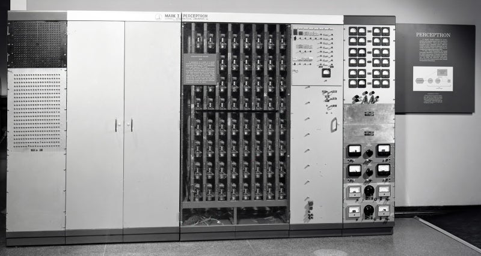

<iframe alt="A.I. &quot;Stefanie Sun&quot;의 Chi Pu 「Cung Đàn Vỡ Đôi」 커버" src="https://www.youtube.com/embed/F9EO8H1o6Bg?feature=oembed" aria-describedby="n97vsvzjb56-figure-caption" allowfullscreen="true" style="width: 100%; aspect-ratio: 16 / 9; height: auto; border: 0; "></iframe>

A.I. "Stefanie Sun"의 Chi Pu 「Cung Đàn Vỡ Đôi」 커버

# 데이터인 모든 것은 공기 속으로 녹아든다

『삼체』의 도입부에서 우주로 보낸 메시지 하나는 인류를 연쇄적인 사건들 속으로 밀어 넣는다. 과학자들이 사라지고, 사회는 갈라지고, 정치적 음모가 얽히며, 외계 종과 마주한 인간의 삶과 존엄이 저울 위에 오른다. A.I.도 같은 일을 벌일 수 있을까. 아주 새로운 질문은 아니다. 아마 우리가 약하고 취약한 존재들을 어떻게 대하는지 알고 있고, 그 그림이 별로 아름답지 않기 때문일 것이다. 나는 의식과 그에 대응하는 자아 감각을 창의성이나 지능과는 별개의 것으로 보는 쪽이다. 그러니 우리가 [생명이 어떻게 무생물에서 생겨났는지](https://www.youtube.com/watch?v=Zaws82fUOA8) 더 잘 이해하려 애쓰는 동안, 그 구분이 시간을 좀 벌어 주면 좋겠다.

Stable Diffusion WebUI로 생성.

최근 Vision Transformer와 Stable Diffusion으로 아주 다양한 스타일의 노래와 이미지를 만들어 보면서, 이제 내가 평생 손으로 그릴 수 있는 수준보다 더 빠르고 더 잘 “그릴” 수 있게 된 것이 꽤 만족스럽다. 동시에 이 모든 일이 얼마나 실증적인 작업이 되어 버렸는지 생각하면 불편하고 불안하다. 내가 붙잡고 씨름해 온 생각은 이런 것이다. 우리가 인간으로서 자랑스러워하는 많은 것들, 그러니까 우리의 창의성과 지능이라는 게 어쩌면 계산 가능한 데이터이자 통계적 현상에 불과한 것 아닐까? 그리고 그 점에서 우리는 기계의 상대가 되지 못한다. 어떤 의미에서는 완전히 맞는 말이고, 그래서 해방적이기도 하다. 하지만 다른 축에서는 중요한 세부가 너무 많이 사라진다. 인간의 활동 상당 부분을 이런 식으로 생각하는 일은 소름 끼치도록 무섭고 불안을 부른다.

Stable Diffusion WebUI로 생성.

Stable Diffusion을 쓰면, 그림에는 관심도 없고 완전히 못 그리는 내가 3070 GPU에서 30초도 안 되어 스타일을 마음대로 바꾸고 변형 이미지 4장을 뽑아낼 수 있다. 몇몇 결과물은 여기에 올려 두었다. 분명히 A.I.는 이상하다. 우리 현실의 아주 특정한 한 단면만 포착하기 때문이다. 여성 인물을 만들 때 그렇게 하지 않으면 모델이 우스꽝스러운 체형을 계속 내놓아서, 나는 “large breasts”와 관련 표현을 네거티브 프롬프트에 꾸준히 넣고 있다. 이 모든 상황은 [이 팟캐스트에서 이야기하듯 정말 이상하고](https://www.nytimes.com/2023/05/02/podcasts/ezra-klein-podcast-transcript-erik-davis.html), 거기서 던진 강력한 질문은 내가 계속 머릿속으로 우물거리던 바로 그 질문이다.

> EZRA KLEIN: 잠깐 매클루언식으로 말해 보죠. 그의 유명한 말, “미디어가 메시지다”를 가져오면요. 미디어가 메시지라면, 미디어가 그것을 쓰는 사람들을 바꾸는 어떤 존재 방식과 사고방식을 품고 있다면, A.I. 챗봇이라는 미디어의 메시지는 무엇이라고 보세요? 덧붙여 둘 만한 점은, 이것이 어떤 기술 위에 세워지고 있는 미디어라는 겁니다. 챗봇으로 대화하는 것은 수많은 응용 중 하나일 뿐이에요. 그런데 바로 그 응용이 치고 올라오고 있다는 사실은, 그 기술이 다른 방식으로 형성될 수도 있었던 경로와 다르게 기술 자체를 빚어 갈 겁니다. 아무튼, 그 미디어의 메시지는 무엇일까요?

Stable Diffusion WebUI로 생성.

인간의 창의성과 지능을 모델링해 예측 기계를 만들었더니 너무 잘 작동한다는 사실은, 개인으로서 우리에게 무엇을 뜻하고 우리는 어떻게 대응해야 할까? 이 생각에 몸을 기울이며 내놓는 잠정적인 답은, 신비의 상실과 경이감은 한 동전의 양면처럼 느껴진다는 것이다. 이런 방식으로 우리의 지능과 창의성을 *작게* 만들면, 긍정적인 결과로는 인간이라는 것의 의미와 우리가 서로에게 빚진 것이 무엇인지 진짜로 다시 평가하게 될 수도 있다. 각 개인의 지능이나 창의성 수준과 무관하게 말이다. 하지만 더 음산한 쪽으로 보자면, 우리가 신중하게 접근하지 않을 경우 A.I.가 무역과 소셜 미디어의 영향을 합친 것보다도 더 깊은 균열을 전 세계 사회에 만들지 않을까 걱정한다.

# 데이터셋의 편향과 효과적인 프롬프트 작성

내가 제품화하려는 일반적인 사용 사례는 자동 콘텐츠 생성이다. A.I.가 내가 원하는 콘텐츠 주제에 맞춰 여러 형식과 언어로 영상 대본과 이미지를 만들고, 그것을 여러 플랫폼에 자동으로 올리게 하는 것. 안타깝게도 이 글은 아직 수작업이다. 그 과정을 거치며 A.I.의 온갖 편향이 그대로 되돌아오는 것을 보는 일은 흥미롭다. 여성 인물을 생성하면, 큰 가슴을 내놓지 말라고 명시하기 전까지 기본값이 전부 육감적인 체형이었다. 그러면 학습에 쓰인 데이터셋을 생각하게 된다. 우리가 미디어에서 보는 것의 얼마나 많은 부분이 현실을 에어브러시로 문질러 놓은 버전인지도. 그러니 사실, 정말로, 누구 탓을 해야 할까?

인터넷에서 그냥 내려받을 수 있는 여러 모델을 실험해 본 뒤, 나는 [그래픽노블에 가까운 스타일](https://civitai.com/models/30711/m4rv3ls-and-dungeons-new-v25)로 가기로 했다. 놀랍지 않게도 성인 콘텐츠 제작에 특화된 모델은 차고 넘친다. 여기에 [textual inversion](https://www.youtube.com/watch?v=2ityl_dNRNw)으로 자기만의 Stable Diffusion 모델을 얼마나 쉽게 맞춤화하고 학습시킬 수 있는지까지 더하면… 다시 말해, 평균적인 게임용 PC만 있어도 누구나 딥페이크 성인 콘텐츠를 만들 수 있다.

정부와 학교와 부모들이 A.I. 문제를 제대로 챙기고 있기를 바란다. 나 그 희망 좀 가져도 되나?

# A.I.는 왜 다른가

부정적인 이야기는 잠깐 내려놓자. 내가 A.I.에 매혹되는 이유는, 1956년 Dartmouth Conference에서 마치 육신을 입고 태어나는 순간을 맞은 뒤 아주 짧은 시간 동안 정말 멀리 왔기 때문이다. 최초의 단층 신경망, 즉 퍼셉트론에서 오늘날의 딥러닝까지. 그리고 A.I.가 이미 무엇을 할 수 있는지는 지금 우리 주변만 둘러봐도 보인다. 그래서 기존 증거에 발 딛고 앞으로를 예측할 수 있다. 다른 많은 기술은 현재에서 발판을 찾으려는 미래의 가능성, 보통은 처참히 실패하는 그런 비전으로 불리지만, A.I.는 이 점에서 독특한 종이다. 그래서 나는 A.I.를 증기기관에 비견하게 됐고, 아마 어떤 이들이 그것을 불이나 전기에까지 견주는 이유도 여기에 있을 것이다.

> “저는 AI를 인류가 작업하고 있는 가장 심오한 기술이라고 늘 생각해 왔습니다. 불이나 전기, 혹은 우리가 과거에 해 온 그 어떤 것보다도 더 심오한 기술입니다.” - Sundar Pichai, Google CEO

Smithsonian 박물관에 전시된 Mark I Perceptron. (출처: https://ronkowitz.blogspot.com/2017/11/perceptron.html)

1958년의 단층 퍼셉트론에는 실제 전선과 거대한 기계가 필요했다. 내가 마지막으로 2022년에 다중 레이블 분류를 해 보려고 몇몇 합성곱 신경망 모델을 만졌을 때는, ResNet-512 같은 모델이 512개 층을 거실의 아주 평범한 게임용 PC 위에서 꾸역꾸역 굴리고 있었다.

A.I.는 기계에 생각하는 능력을 주고 싶어 하는 인간의 관심을 얼어붙게 하지 못한 여러 번의 겨울에 관한 이야기다. 여러 차례 A.I. 겨울의 긴 밤, 통계로 방향을 튼 전환, 오래된 모델 위에 데이터와 GPU가 합류하며 가능해진 캄브리아기적 폭발, 그리고 신경망의 궁극적인 귀환까지. 이 모든 것은 다음에 파고들어 보고 싶은 것들이다!

---

*원래 PubPub의 [erniesg.pubpub.org/pub/33ietk6v](https://erniesg.pubpub.org/pub/33ietk6v)에 게시한 글.*
