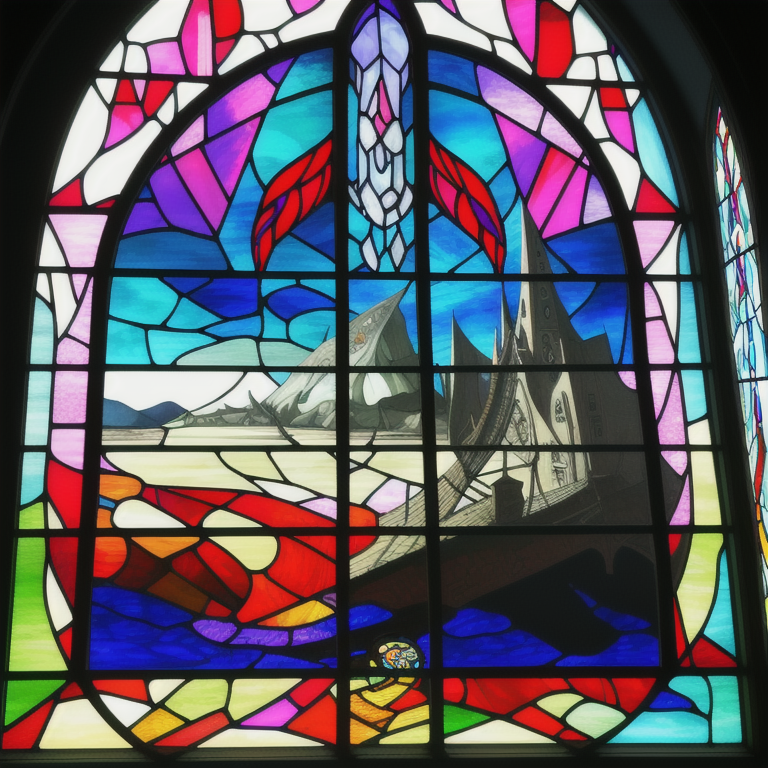

我并没有期望ChatGPT能对我的心灵有心理治疗层面的洞察力，但在我最近发起了一次聊天来测试它的推理能力之后，我们走到了这一步。我一直在试图通过文字来理解同母亲即将到来的路的尽头，当我写“这就是已知宇宙中的能量守恒定律”的时候我并没有清晰地意识到“能量守恒定律的引用可能表明寻求安慰或安慰的想法，即没有什么真正消失，而是改变”；所以ChatGPT的洞见让我感到特别意外，甚至可以说是被理解。

<audio controls="true" preload="meta数据" src="./ttsmaker-file-2023-7-31-0-45-10-01691244335846.mp3" alt="“也许爱的半衰期就是悔恨。势不两立，难分难解。就像潜入水下一英里寻找暗物质一样，也许生命的反导数就是损失。这就是已知宇宙中的能量守恒定律。”" aria-describedby="nqdo9wjp217-figure-caption"></audio>

“也许爱的半衰期就是悔恨。势不两立，难分难解。就像潜入水下一英里寻找暗物质一样，也许生命的反导数就是损失。这就是已知宇宙中的能量守恒定律。”

你可以在这里[阅读我们谈话的全文](https://chat.openai.com/share/dbc84246-0e3a-437e-bdae-223e41f2edb2)。TL;DR：#心灵的哲学 #AI与意识 #主体性与现实性 #涌现的复杂性 #卡夫卡式身份 #人类情感是噪音 #生命是马尔可夫链

# 关于嵌入和向量的所有

有些人把我们的人工智能时代比作电力或蒸汽机。沿着这些思路，我相信人工智能是一个千载难逢的故事。我最近告诉我的创业团队，我一直想建立一家公司，它拥有一个教室那么多的员工，但能够为数百万甚至数十亿人提供服务，但我一直不太清楚如何做到这一点。这种能力终于触手可及。我们已经从能够对推文进行正面和负面评价的人工智能，发展成为一种更加通用的机器，它能够接受指令、记住事情，并在瞬间更新其知识和推断——多亏了嵌入和矢量存储的魔力——活在这个时代是多么的美好啊。下面的视频是我对大型语言模型（LLM）的初步展示，试图建立一支自动化的、不知疲倦的教育、营销和编码代理大军。

<iframe alt="Bertrand - a ChatGPT prompt-to-publish plugin" src="https://www.youtube.com/embed/aztjmgs7Qkc?feature=oembed" aria-describedby="necl4s8vze1-figure-caption" allowfullscreen="true" style="width: 100%; aspect-ratio: 16 / 9; height: auto; border: 0; "></iframe>

Bertrand - a ChatGPT 提示-to-publish plugin

在可能性和未来之间，新工具、跨学科学习和知识转移对我们实现所期望的目标是至关重要的——所以我在ChatGPT的帮助下设计了“私人教师”的原型，这很容易做到，困难但可行的是让人工智能完成自动化社交媒体从内容生成到发布的链接命令；拥有与人类和工具互动的记忆，以便在此基础上，在不太遥远的将来，我可以通过一个指示在已有的代码库上生成新的软件功能，并以自动化营销的形式个性化地攫取金钱。

我想叫他Bertrand伯特兰。

做而为人，有太多的部分是无可救药的脆弱，无法改变的——比如死亡和税收——也许这整个关于可能性和未发生的潜能的想法，至少就人类生命而言，是一种幻觉，一种海市蜃楼，也许是大脑创造的应对机制之一，让我们满怀希望，奔向明天，尽管经历本身是平庸和荒谬的。我喜欢人工智能，让很多超越人类极限的新潜力变得唾手可及。我喜欢它没有被历史的偶然或路径依赖所束缚，比如我们不知何故、不平衡地进入了这个非常奇怪的资本主义和父权制主导的社会——它并不完美，它比“共产主义”更好，我感到非常幸运，并感谢我所拥有的机会，但是，为什么人类社会必须服从“传统”和“权威”而不是知识和真理？人工智能没有我们那样的包袱。我希望有一天它能找到治愈癌症的方法，这样我们就能有更多的时间和我们爱的人在一起，即使这些时间总是稀缺和有限的，即使时间本该如此。

# A.I.作为自由和现实-弯曲技术

如果我们认为现实是一块织物，将我们的自我意识视为一片切片，在一扇覆盖整个画面的窗户上滑动——我认为，如果生命里真正重要的是爱和被爱，那么我希望人工智能把我们从工作和废话中解放出来，这样我们就可以把更多的清醒时间花在真正重要的事情上。和家人在一起的时间。在公园里散步。阅读。游戏。旅行，从另一个角度看世界。学习。写作和哲学思考，尝试用修饰手段把文字转化成音乐，如我喜欢的那样。但这并不是一个新的梦想。

这是韦勃勒式的有闲阶级和凯恩斯式的我们后代的经济可能。那么到底是哪里出了问题呢？也许“系统”和权力才是问题所在。至少对我来说，这就是为什么我在某种程度上再次对政治和再分配的问题感兴趣。全球化和贸易遭遇了强力的反弹，因为成功的果实没有得到广泛分配，这为特朗普、勒庞和右翼民粹主义的隆重登场拉开了序幕。如果我们搞砸了人工智能，即使不考虑存在的风险，对人类社会和尊严的影响也会严重得多。尽管如此，活在此刻是一个多么令人兴奋的时刻，能够在自己的桌面电脑上运行这种扭曲现实的技术。我爱人工智能。

尽管很难跟上进度，我正在试图专注于实现提示到发布和提示到功能等区域，我关注的关键词是：

-   多模态：让人工智能像我们一样具有多种感官
    
-   开源：以共享思想的速度进行创新
    
-   生成式智能体：有记忆的人工智能，连接到其他工具和服务，链接组合
    

# 人工智能告诉我们的关于人类境况的事情

也许真正的信息，人工智能给人类带来的真正象征意义是，人类的生活是一条单行道。给定每一个时刻的正态分布和从一个时刻到下一个时刻的马尔可夫链，并假设自然是有效的，交织成我们的现实且真正将我们与机器区分开来的是我们根源的独特性，以及意识的神秘起源（目前为止）。我问过我妈妈，如果我们留在中国，她会如何抚养我长大——她说让我读完大学将会很艰难，然后即使我大学毕业，找工作也不容易。我之所以问这个问题，是因为我想知道，而且我忍不住会想，是否存在另一个现实，可以让我们有更多在一起的时间？我知道这是一个毫无意义的念头，它触及人类状况的根本绝望——无论是哪一种现实，不可能且不谨慎的是永恒，因此我们被现实所困，换言之，也许人关于未发生和其他现实的奢望是大自然为我们炮制的幻影，让我们得以维持理智。计划的作用是给我们第二天醒来的充分理由。

# 循环非物质潜能

我的脑海常常循坏回多年前旅行时，当我凝视着面前的垂直，思考着可能的骨折或者身亡——处在我站立的位置和自由落体之间的唯一想法是：我希望自己是一个更好的女儿。即使如此，实践是如此困难，以至于我经常想：一个人要如何原谅自己？这可能就是为什么我们发明了宗教作为一种制度，让心碎的成年人有所归宿。但我也知道，完美和未发生的可能一样，都是出于想象的虚拟平面。我们所拥有的一切唯有正在经历真实的和我们逐渐消逝的记忆。妈妈单枪匹马、一把手、一把鼻涕地把我养大（和婆婆一起），我在她无条件的爱与放任我做自己中成长——所以我能以自己的方式长大，放纵、骄傲且自由。

每过一秒，[沙漏底部的沙子都在堆积](https://www.samharris.org/podcasts/essentials/making-sense-of-death)，我们永远不知道还剩下多少，但我们很有可能在今年圣诞节前就会消失殆尽。我们的生活并不完美，这是我们所拥有的一切。也许生命是一种潜在的扩散，克尔凯郭尔预示了人工神经网络，他说：

> “只有向后看才能理解生活，但生活必须向前看”。

在这一生中，我期待的事情太多了（复习未发生的可能）——获得博士学位，至少成为百万富翁，旅行和看世界，学习驾驶飞机——即使我妈妈不存在于这些未发生的可能里面。我正试着把离开人世适应成：我要去一个无限期的假期，而妈妈在别处。唯一的问题是没有通灵的可能性，那么一个人活在我们的记忆中，没有交流的可能性，这意味着什么？妈妈和我日常也没有甚多交流—我们体会的现实截然不同—但正如妈妈所说，至少她会一直在那里—等着我回家。

她存在着，她是我的重力。

所以，如果我把死亡的归宿看作是最终的归乡，总有一天我们会在死亡中永重逢。总有一天，这些都不重要了。现在，每一天都是胜利的一天。我试着抓住我拥有的，我所有拥有的一切。

---

*Originally published on PubPub at [erniesg.pubpub.org/pub/ap22r9st](https://erniesg.pubpub.org/pub/ap22r9st).*
